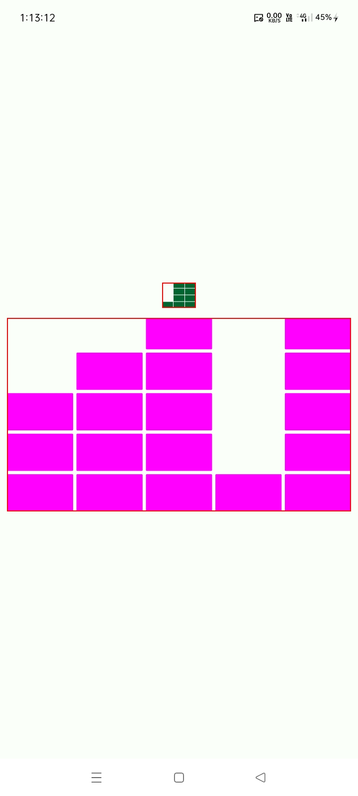
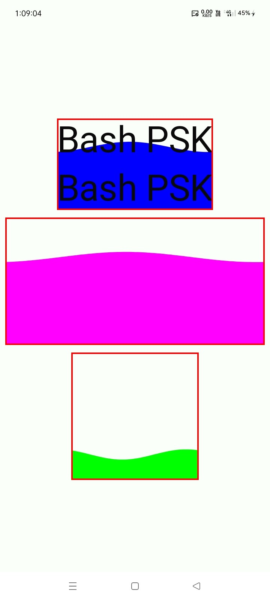

# ✨ Animations

[](https://jitpack.io/#com.github.bashpsk.emptylibs/animations)
[](https://opensource.org/licenses/Apache-2.0)

A collection of fluid and customizable Jetpack Compose animations, featuring music visualizers and
dynamic wave effects.

---

## ✨ Features

- **Music Playing Animation**: Customizable music visualizer with vertical bars and adjustable
  easing.
- **Wave Animation**: Fluid, animated wave modifier that can be applied to any Composable.
- **Visibility Aware**: Automatically manages animation states based on component visibility.
- **High Performance**: Optimized using low-level Compose animation APIs.

---

## 📦 Installation

### Groovy (`build.gradle`)

```groovy
dependencies {
    implementation 'com.github.bashpsk.emptylibs:animations:VERSION'
}
```

### Kotlin DSL (`build.gradle.kts`)

```kotlin
dependencies {
    implementation("com.github.bashpsk.emptylibs:animations:VERSION")
}
```

### Kotlin DSL (`build.gradle.kts`) + Version Catalog (`libs.versions.toml`)

```toml
[versions]
empty-libs = "VERSION"

[libraries]
emptylibs-animations = { group = "com.github.bashpsk.emptylibs", name = "animations", version.ref = "empty-libs" }
```

```kotlin
dependencies {
    implementation(libs.emptylibs.animations)
}
```

---

## 🛠️ Usage

### 🎵 Music Playing Animation

A visualizer-style animation with customizable bars, spacing, and easing.

```kotlin
// Basic Usage
MusicPlayingAnimation(
    modifier = Modifier.size(48.dp),
    isPlaying = true
)

// Customized Usage
MusicPlayingAnimation(
    modifier = Modifier.size(width = 80.dp, height = 40.dp),
    isPlaying = true,
    boxColor = Color.Magenta,
    barCount = 8,
    boxCount = 6,
    boxSpacing = 0.1f,
    easing = EaseInOutCubic
)
```

### 🌊 Wave Animation Modifier

Apply a fluid wave effect to any Composable using the `waveAnimation` modifier.

```kotlin
val infiniteTransition = rememberInfiniteTransition(label = "Wave Transition")

val waveOffset by infiniteTransition.animateFloat(
    initialValue = 0f,
    targetValue = 1f,
    animationSpec = infiniteRepeatable(
        animation = tween(durationMillis = 3000, easing = LinearEasing),
        repeatMode = RepeatMode.Restart
    ),
    label = "Wave Offset"
)

Box(
    modifier = Modifier
        .fillMaxWidth()
        .height(150.dp)
        .background(Color.LightGray)
        .waveAnimation(
            progress = 0.6f,         // Fill level (0.0 to 1.0)
            waveOffset = waveOffset, // Animation progress
            waveColor = Color.Cyan,
            amplitude = 12.dp        // Height of the wave
        )
)
```

---

## 📸 Screenshots

| Music Playing                                                 | Wave Effect                                                 |
|---------------------------------------------------------------|-------------------------------------------------------------|
|  |  |

https://github.com/user-attachments/assets/ff534241-78df-47ef-9a6e-763aa799abfc

https://github.com/user-attachments/assets/6c10b5c4-ab2b-4627-894c-7d7e6f1e2b7a

---
