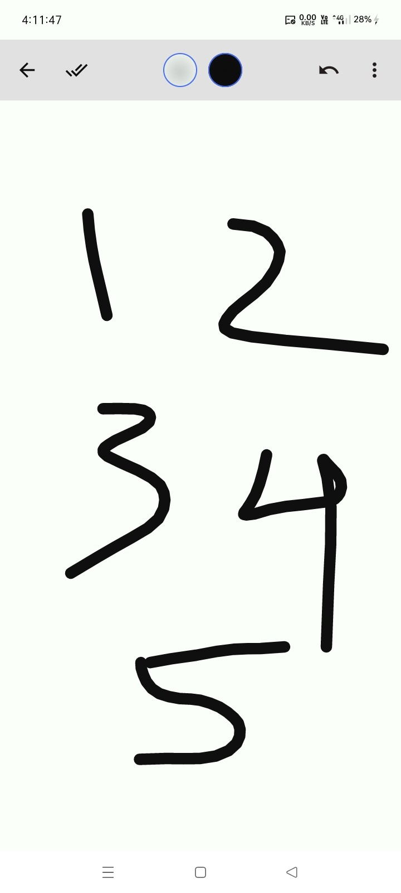

# ✍️ Canvas Slate

[](https://jitpack.io/#com.github.bashpsk.emptylibs/canvas-slate)
[](https://opensource.org/licenses/Apache-2.0)

A powerful and customizable drawing pad for Jetpack Compose, designed for an intuitive drawing and
path editing experience. `canvas-slate` provides a complete drawing solution out of the box,
allowing users to draw free-form paths, customize colors, adjust stroke properties, and even edit
individual paths after they have been drawn.

---

## ✨ Features

- **Free-form Drawing**: Smooth and responsive drawing on the canvas.
- **Advanced Color Customization**: Separate color pickers for both the canvas background and the
  drawing brush.
- **Comprehensive Brush Controls**: Adjust brush thickness, stroke cap (Round, Square), and stroke
  join (Bevel, Miter).
- **Path Editing**: Select and modify the properties (color, thickness, etc.) of individual paths
  after they are drawn.
- **State Management**: Robust `CanvasSlateState` that manages tools, paths, and undo/redo history.
- **Export**: Capture the final drawing as an `ImageBitmap` to save or share.

---

## 📦 Installation

### Groovy (`build.gradle`)

```groovy
dependencies {
    implementation 'com.github.bashpsk.emptylibs:canvas-slate:VERSION'
}
```

### Kotlin DSL (`build.gradle.kts`)

```kotlin
dependencies {
    implementation("com.github.bashpsk.emptylibs:canvas-slate:VERSION")
}
```

### Kotlin DSL (`build.gradle.kts`) + Version Catalog (`libs.versions.toml`)

```toml
[versions]
empty-libs = "VERSION"

[libraries]
emptylibs-canvas-slate = { group = "com.github.bashpsk.emptylibs", name = "canvas-slate", version.ref = "empty-libs" }
```

```kotlin
dependencies {
    implementation(libs.emptylibs.canvas.slate)
}
```

---

## 🛠️ Usage

Integrating `CanvasSlate` is straightforward. Use `rememberCanvasSlateState()` to manage the canvas
state and pass it to the composable.

```kotlin
val canvasSlateState = rememberCanvasSlateState()
val coroutineScope = rememberCoroutineScope()

CanvasSlate(
    modifier = Modifier.fillMaxSize(),
    state = canvasSlateState,
    onDoneClick = {
        coroutineScope.launch(Dispatchers.IO) {
            canvasSlateState.getImageBitmap()?.let { imageBitmap -> }
        }
    },
    onNavigateBack = { /* Handle back navigation */ }
)
```

---

## 📸 Screenshots

| Canvas Slate                                      |
|---------------------------------------------------|
|  |

https://github.com/user-attachments/assets/07ffb810-a1bb-4db2-b50b-dea5fdc1a626

---