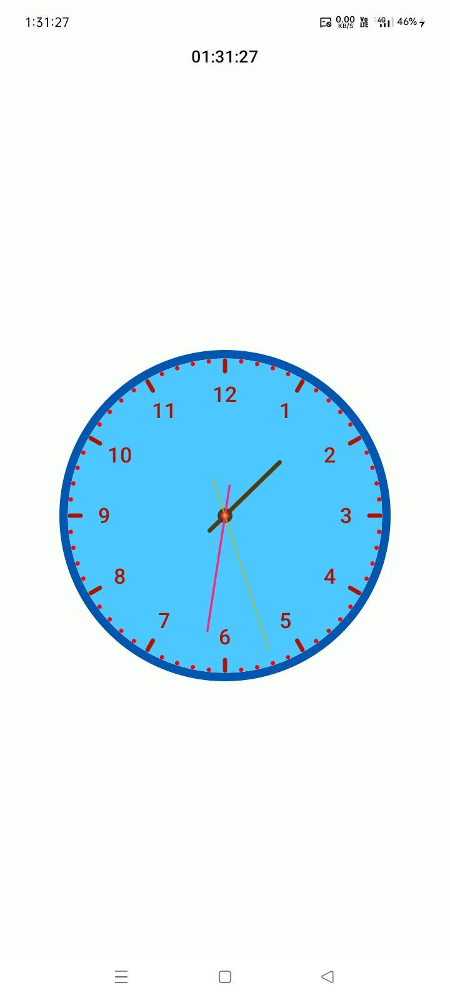
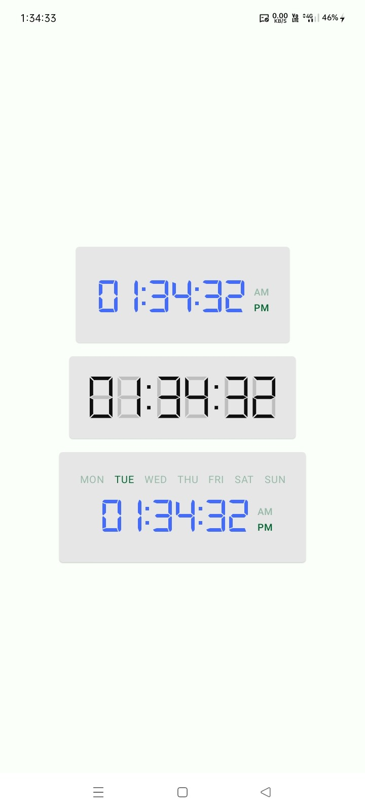

# 🧩 Compose Widgets

[](https://jitpack.io/#com.github.bashpsk.emptylibs/compose-widgets)
[](https://opensource.org/licenses/Apache-2.0)

A collection of reusable, highly customizable UI widgets for Jetpack Compose, featuring functional
clocks and more.

---

## ✨ Features

- **Analog Clock**: Fully functional analog clock with customizable hands, borders, and numbering
  styles.
- **Digital Clock**: Modern digital clock with support for 12/24h formats and customizable fonts.
- **Highly Themeable**: Easily adjust colors, shapes, and sizes via property classes.
- **Lifecycle Aware**: Updates efficiently based on visibility and app state.

---

## 📦 Installation

### Groovy (`build.gradle`)

```groovy
dependencies {
    implementation 'com.github.bashpsk.emptylibs:compose-widgets:VERSION'
}
```

### Kotlin DSL (`build.gradle.kts`)

```kotlin
dependencies {
    implementation("com.github.bashpsk.emptylibs:compose-widgets:VERSION")
}
```

### Kotlin DSL (`build.gradle.kts`) + Version Catalog (`libs.versions.toml`)

```toml
[versions]
empty-libs = "VERSION"

[libraries]
emptylibs-compose-widgets = { group = "com.github.bashpsk.emptylibs", name = "compose-widgets", version.ref = "empty-libs" }
```

```kotlin
dependencies {
    implementation(libs.emptylibs.compose.widgets)
}
```

---

## 🛠️ Usage

### Analog Clock

```kotlin
AnalogClock(
    modifier = Modifier.size(200.dp),
    dateTimeMillis = System.currentTimeMillis()
)
```

### Digital Clock

```kotlin
DigitalClock(
    modifier = Modifier.fillMaxWidth(),
    dateTimeMillis = System.currentTimeMillis()
)
```

---

## 📸 Screenshots

| Analog Clock                                                      | Digital Clock                                                      |
|-------------------------------------------------------------------|--------------------------------------------------------------------|
|  |  |

[//]: # (https://github.com/user-attachments/assets/07ffb810-a1bb-4db2-b50b-dea5fdc1a626)

---