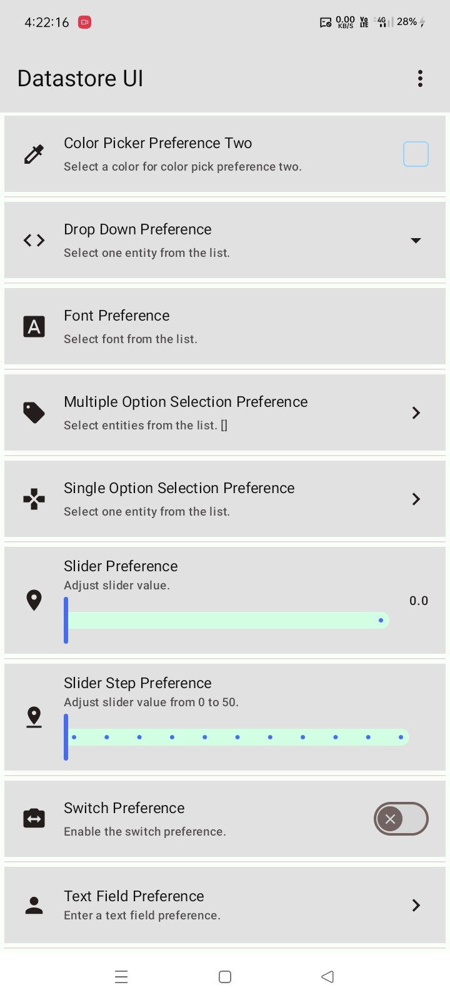

# Datastore UI - A Settings UI Library for Jetpack Datastore

A comprehensive UI library for Jetpack Compose that provides pre-built preference components to
easily create settings screens powered by Jetpack DataStore.

`datastore-ui` simplifies the process of building user-facing settings by offering a collection of
ready-to-use composables like switches, checkboxes, sliders, and pickers. These components
automatically handle state management by reading from and writing to Jetpack DataStore, allowing you
to build feature-rich settings screens with minimal boilerplate.

---

## Features

- **DataStore-Powered Components**: A set of preference composables directly linked to your Jetpack
  DataStore.

- **Minimal Boilerplate**: Automatically handles collecting preference state and updating DataStore
  when the user interacts with a setting.

- **Variety of Preferences**: Includes a wide range of common preference types:
    - **CardPreference**: A simple clickable preference item.
    - **SwitchPreference** & **CheckBoxPreference**: For boolean (on/off) settings.
    - **SliderPreference**: For selecting a value from a continuous or discrete range (Int/Float).
    - **DropDownPreference** & **ListOptionPreference**: For selecting a single option from a list.
    - **SetOptionPreference**: For selecting multiple options from a list.
    - **ColorPickPreference**: An integrated color picker for color-based settings.
    - **TextFieldPreference**: For user-editable text-based settings.

- **Centralized State Management**:  Uses a `CompositionLocal` (`LocalDatastore`) to provide the
  DataStore instance to all descendant composables, avoiding the need to pass it down manually.

- **Easy to Customize**: Built on top of **Material3** components, making them easy to style and
  integrate into your existing app theme.

---

## Installation

**Groovy (`build.gradle`):**

```groovy
dependencies {
    implementation 'com.github.bashpsk.emptylibs:datastore-ui:<latest-version>'
}
```

**Kotlin DSL (`build.gradle`):**

```kotlin
dependencies {
    implementation("com.github.bashpsk.emptylibs:datastore-ui:<latest-version>")
}
```

**Kotlin DSL with Version Catalogs:**

```toml
[versions]
empty-libs = "<latest-version>"

[libraries]
emptylibs-datastore-ui = { group = "com.github.bashpsk.emptylibs", name = "datastore-ui", version.ref = "empty-libs" }
```

```kotlin
dependencies {
    implementation(libs.emptylibs.datastore.ui)
}
```

---

## Usage

Integrating `datastore-ui` is simple. First, provide your DataStore instance at the root of your
settings screen using CompositionLocalProvider. Then, use the preference composables within that
scope.

### 1. Provide the DataStore Instance

Use `LocalDatastore` to make your `DataStore<Preferences>` instance available to all preference
composables.

```kotlin
val Context.datastore by preferencesDataStore(name = "DATASTORE-UI-PSK")

val getAppTheme by datastore.getPreference(
    key = booleanPreferencesKey("dark_mode"),
    initial = true
).collectAsStateWithLifecycle(initialValue = true)

CompositionLocalProvider(LocalDatastore provides datastore) {
    MyAppTheme(darkTheme = getAppTheme) {
        SettingsScreen() {
            SwitchPreference(
                key = booleanPreferencesKey("dark_mode"),
                title = "Enable Dark Mode",
                summary = "Toggle the app's theme"
            )
        }
    }
}
```

### 2. Use the Preference Composables

Here are examples for each type of preference available in the library.

#### CardPreference

A simple, clickable item, suitable for navigation or triggering an action.

```kotlin
CardPreference(
    title = "Account Settings",
    summary = "View and edit your account details",
    onClick = { /* Navigate to account screen */ }
)
```

#### SwitchPreference

A toggle for `Boolean` values, with an icon inside the thumb.

```kotlin
SwitchPreference(
    key = booleanPreferencesKey("notifications_enabled"),
    title = "Enable Notifications",
    initialValue = true
)
```

#### CheckBoxPreference

A checkbox for `Boolean` values.

```kotlin
CheckBoxPreference(
    key = booleanPreferencesKey("auto_save_enabled"),
    title = "Enable Auto-Save",
    summary = "Automatically save your work in the background"
)
```

#### SliderPreference

A slider to select a `Float` or `Int` from a given range.

```kotlin
SliderPreference(
    key = floatPreferencesKey("volume_level"),
    title = "Media Volume",
    initialValue = 0.5f,
    valueRange = 0f..1f,
    steps = 10,
    isValueVisible = true
)
```

#### DropDownPreference

A preference that reveals a dropdown menu to select a single `String` or other value.

```kotlin
val themes = mapOf("Light" to "light", "Dark" to "dark", "System" to "system")
DropDownPreference(
    key = stringPreferencesKey("app_theme"),
    title = "App Theme",
    initialValue = "system",
    entities = themes
)
```

#### ListOptionPreference

Opens a dialog with a list of radio buttons to select a single option.

```kotlin
val downloadQualities = mapOf("High" to "1080p", "Medium" to "720p", "Low" to "480p")
ListOptionPreference(
    key = stringPreferencesKey("download_quality"),
    title = "Download Quality",
    initialValue = "720p",
    entities = downloadQualities,
    enableResetButton = true
)
```

#### SetOptionPreference

Opens a dialog with a list of checkboxes to select multiple options, saved as a `Set<String>`.

```kotlin
val notificationTypes = mapOf(
    "New Followers" to "followers",
    "Direct Messages" to "dms",
    "Mentions" to "mentions"
)
SetOptionPreference(
    key = stringSetPreferencesKey("notification_filter"),
    title = "Notification Filter",
    initialValue = setOf("followers", "dms"),
    entities = notificationTypes,
    enableResetButton = true
)
```

#### ColorPickPreference

Opens a color picker dialog to select an `Int` color value.

```kotlin
ColorPickPreference(
    key = intPreferencesKey("chat_bubble_color"),
    title = "Chat Bubble Color",
    initialValue = Color.Blue.toArgb(),
    enableAlphaPanel = true,
    enableResetButton = true
)
```

#### TextFieldPreference

Opens a dialog with a text field for `String` input.

```kotlin
var username by remember { mutableStateOf(TextFieldValue("Default User")) }
TextFieldPreference(
    key = stringPreferencesKey("username"),
    title = "Username",
    summary = "Your public display name",
    textFieldValue = username,
    textFieldContent = {
        OutlinedTextField(
            value = username,
            onValueChange = { username = it },
            label = { Text("Enter username") }
        )
    }
)
```

### 3. Menu Item Preferences

These composables are designed to be used inside a `DropdownMenu` or a similar menu container.

#### SwitchMenuPreference

A `DropdownMenuItem` with a Switch, perfect for toggling a `Boolean` setting from a menu.

```kotlin
var expanded by remember { mutableStateOf(false) }

Box {
    IconButton(onClick = { expanded = true }) {
        Icon(Icons.Default.MoreVert, contentDescription = "More options")
    }
    DropdownMenu(
        expanded = expanded,
        onDismissRequest = { expanded = false }
    ) {
        SwitchMenuPreference(
            key = booleanPreferencesKey("in-app_previews"),
            title = "In-App Previews",
            initialValue = true,
            onMenuDismiss = { expanded = false }
        )
    }
}
```

#### ListOptionMenuPreference

A `DropdownMenuItem` that opens a dialog to select a single option from a list, ideal for settings
within an options menu.

```kotlin
var expanded by remember { mutableStateOf(false) }
val alertTones = mapOf("Default" to "tone_default", "Orion" to "tone_orion", "Vega" to "tone_vega")

Box {
    IconButton(onClick = { expanded = true }) {
        Icon(Icons.Default.MoreVert, contentDescription = "More options")
    }
    DropdownMenu(
        expanded = expanded,
        onDismissRequest = { expanded = false }
    ) {
        ListOptionMenuPreference(
            key = stringPreferencesKey("alert_tone"),
            title = "Alert Tone",
            initialValue = "tone_default",
            entities = alertTones,
            onMenuDismiss = { expanded = false }
        )
    }
}
```

---

## Screenshots & Demo

| Settings UI                                       |
|---------------------------------------------------|
|  |

https://github.com/user-attachments/assets/64f4902b-2fe0-4a2e-88c9-5851d0ca22e0

---