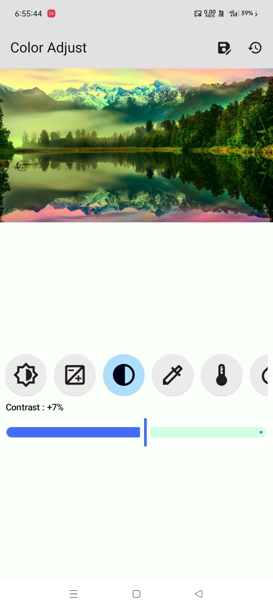
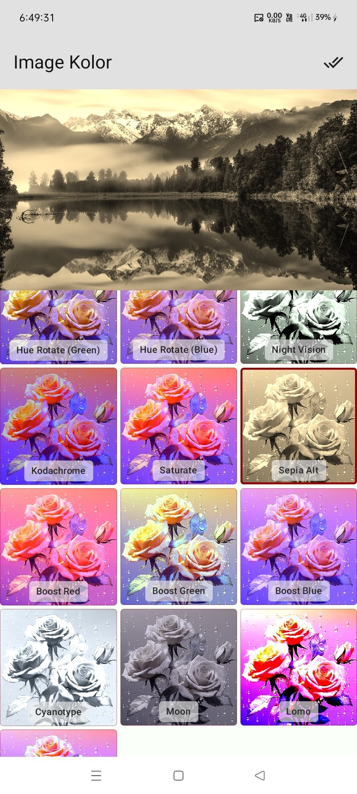

# Image Kolor - Image Filtering & Color Adjustment for Jetpack Compose

An advanced, easy-to-use Jetpack Compose library for applying powerful color adjustments and a wide
variety of pre-built filters to images.

`image-kolor` provides two main features in a simple, configurable package. The Image Color offers a
set of sliders to fine-tune properties like brightness, contrast, saturation, and more. The Image
Filter gives you a collection of one-tap artistic and corrective filters, similar to those found in
popular photo editing apps.

Both features are designed for seamless integration, offering real-time previews and a
straightforward API to generate the final edited `ImageBitmap`.

---

## Features

- **Image Color Adjustment (`ImageKolor`)**: Manually adjust image colors using sliders for
    - Brightness
    - Contrast
    - Saturation
    - Gamma
    - Hue
    - Sharpness
    - Vibrance

- **Image Filtering (`ImageFilter`)**: Apply a variety of pre-built template filters, including:
    - Grayscale
    - Sepia
    - Invert
    - Black & White
    - Vintage
    - Cool & Warm
    - Night Vision
    - Saturate

- **Live Previews**: See the effects of adjustments and filters applied to the image in real-time.

- **Robust State Management**: Uses `rememberImageKolorState()` and `rememberImageFilterState()` to
  manage all adjustments and selected filters, ensuring state is preserved across recompositions.

- **Easy Integration**: Simply provide an `ImageBitmap` and add the composable to your UI.

- **High Performance**: Optimized for smooth slider interactions and quick filter application.

- **Export Final Image**: Easily generate an `ImageBitmap` with all the applied color adjustments or
  filters.

---

## Installation

**Groovy (`build.gradle`):**

```groovy
dependencies {
    implementation 'com.github.bashpsk.emptylibs:image-kolor:<latest-version>'
}
```

**Kotlin DSL (`build.gradle`):**

```kotlin
dependencies {
    implementation("com.github.bashpsk.emptylibs:image-kolor:<latest-version>")
}
```

**Kotlin DSL with Version Catalogs:**

```toml
[versions]
empty-libs = "<latest-version>"

[libraries]
emptylibs-image-kolor = { group = "com.github.bashpsk.emptylibs", name = "image-kolor", version.ref = "empty-libs" }
```

```kotlin
dependencies {
    implementation(libs.emptylibs.image.kolor)
}
```

---

## Usage

### Image Color Adjustment

The `ImageKolor` composable provides a UI with a live preview and sliders for adjusting various
color properties.

Create an `ImageKolorState`, pass your source `ImageBitmap`, and use the `ImageKolor` composable.

```kotlin
val kolorState = rememberImageKolorState(imageBitmap = baseImage)

ImageKolorLayout(
    modifier = Modifier.fillMaxSize(),
    state = kolorState
)

Button(
    onClick = {
        val finalImage = kolorState.getColorImage()
    }
) {
    Text("Get Image")
}
```

### Image Filtering

The `ImageFilter` composable provides a UI with a live preview and a list of selectable filter
templates.

Create an `ImageFilterState`, pass your source `ImageBitmap`, and use the `ImageFilter` composable.

```kotlin
val filterState = rememberImageFilterState(previewImage = previewImage) // previewImage is Optional

ImageFilterLayout(
    modifier = Modifier.fillMaxSize(),
    imageBitmap = imageBitmap,
    state = filterState
)

Button(
    onClick = {
        val finalImage = filterState.getFilterImage(image = imageBitmap)
    }
) {
    Text("Get Image")
}
```

---

## Screenshots & Demo

### Image Kolor:

| Color Adjust - Before                              | Color Adjust - After                               | Color Adjust - Landscape                           |
|----------------------------------------------------|----------------------------------------------------|----------------------------------------------------|
|  |  |  |

https://github.com/user-attachments/assets/9e9baaa1-4a2a-4817-88a2-e94da71fa71e

### Image Filter:

| Color Filter - Before                               | Color Filter - After                                | Color Filter - Landscape                            |
|-----------------------------------------------------|-----------------------------------------------------|-----------------------------------------------------|
|  |  |  |

https://github.com/user-attachments/assets/a60003cd-a616-4a4c-a86e-e8fa180d123f

---