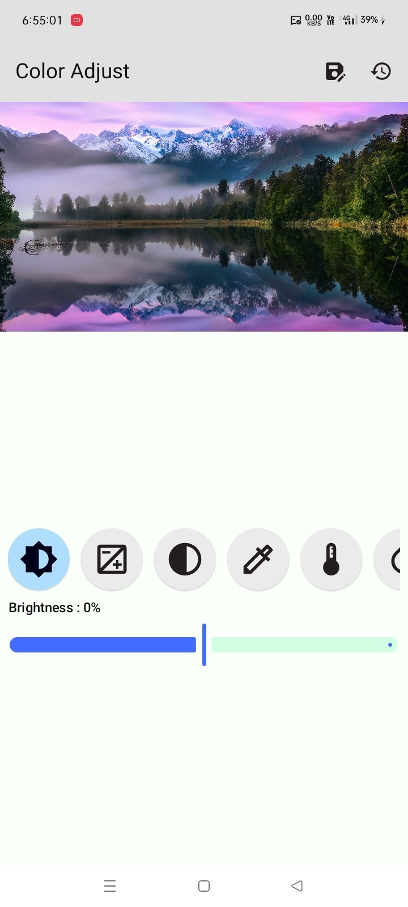
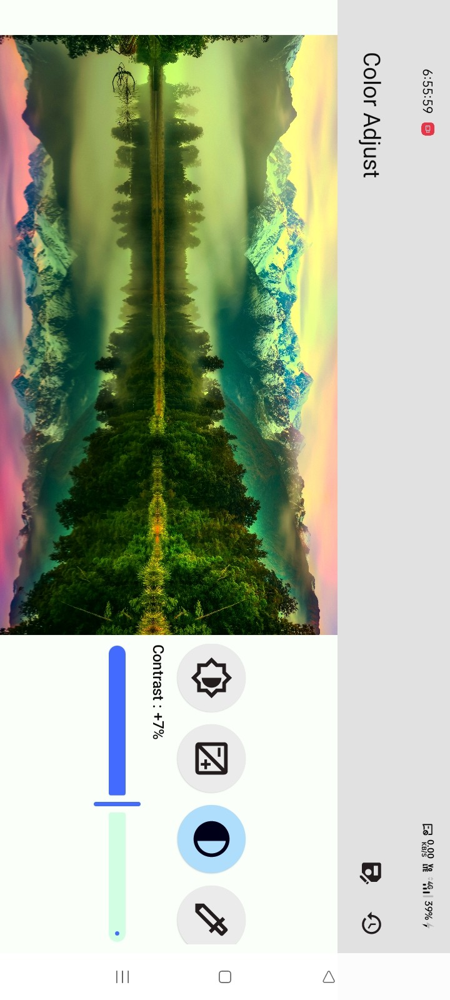
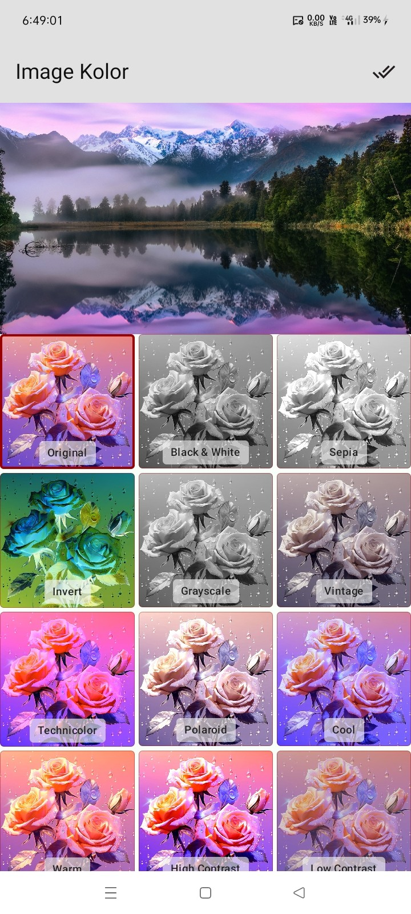
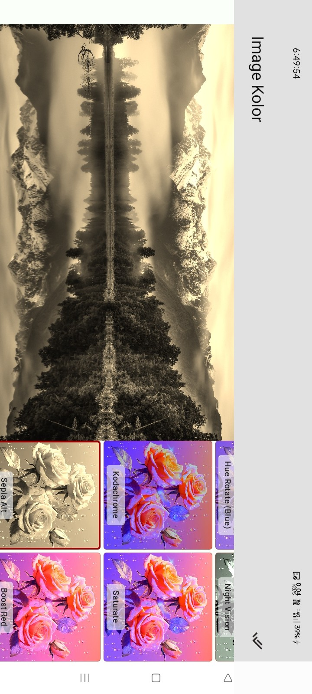

# 🌈 Image Kolor

[](https://jitpack.io/#com.github.bashpsk.emptylibs/image-kolor)
[](https://opensource.org/licenses/Apache-2.0)

Advanced image filtering and color adjustment for Jetpack Compose. Fine-tune image properties with
sliders or apply artistic filters with a single tap.

---

## ✨ Features

- **Color Adjustments**: Sliders for Brightness, Contrast, Saturation, Gamma, Hue, and Sharpness.
- **Pre-built Filters**: Grayscale, Sepia, Invert, Vintage, Night Vision, and more.
- **Live Previews**: Real-time feedback as you adjust properties or select filters.
- **High Performance**: Optimized for smooth interactions and quick rendering.
- **Modular Components**: Separate layouts for color adjustment and filtering.

---

## 📦 Installation

### Groovy (`build.gradle`)

```groovy
dependencies {
    implementation 'com.github.bashpsk.emptylibs:image-kolor:VERSION'
}
```

### Kotlin DSL (`build.gradle.kts`)

```kotlin
dependencies {
    implementation("com.github.bashpsk.emptylibs:image-kolor:VERSION")
}
```

### Kotlin DSL (`build.gradle.kts`) + Version Catalog (`libs.versions.toml`)

```toml
[versions]
empty-libs = "VERSION"

[libraries]
emptylibs-image-kolor = { group = "com.github.bashpsk.emptylibs", name = "image-kolor", version.ref = "empty-libs" }
```

```kotlin
dependencies {
    implementation(libs.emptylibs.image.kolor)
}
```

---

## 🛠️ Usage

### Color Adjustment

```kotlin
val kolorState = rememberImageKolorState(imageBitmap = baseImage)

ImageKolorLayout(
    modifier = Modifier.fillMaxSize(),
    state = kolorState
)
```

### Image Filtering

```kotlin
val filterState = rememberImageFilterState(previewImage = previewImage) // previewImage is Optional

ImageFilterLayout(
    modifier = Modifier.fillMaxSize(),
    imageBitmap = imageBitmap,
    state = filterState
)

Button(
    onClick = {
        val finalImage = filterState.getFilterImage(image = imageBitmap)
    }
) {
    Text("Get Image")
}
```

---

## 📸 Screenshots

### Color Adjust:

| Before                                                         | After                                                         | Landscape                                                         |
|----------------------------------------------------------------|---------------------------------------------------------------|-------------------------------------------------------------------|
|  |  |  |

https://github.com/user-attachments/assets/9e9baaa1-4a2a-4817-88a2-e94da71fa71e

### Image Filter:

| Before                                                         | After                                                         | Landscape                                                         |
|----------------------------------------------------------------|---------------------------------------------------------------|-------------------------------------------------------------------|
|  |  |  |

https://github.com/user-attachments/assets/a60003cd-a616-4a4c-a86e-e8fa180d123f

---