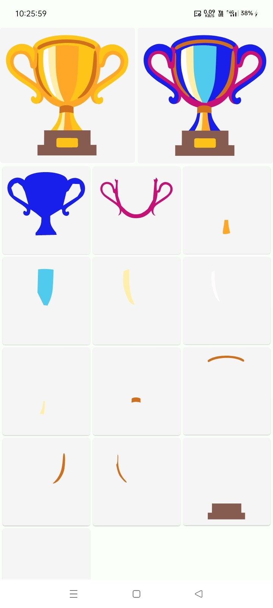

# 🌈 Image Kolor

[](https://jitpack.io/#com.github.bashpsk.emptylibs/image-kolor)
[](https://opensource.org/licenses/Apache-2.0)

Advanced image filtering and color adjustment for Jetpack Compose. Fine-tune image properties with
sliders or apply artistic filters with a single tap.

---

## ✨ Features

- **Color Adjustments**: Sliders for Brightness, Contrast, Saturation, Gamma, Hue, and Sharpness.
- **Pre-built Filters**: Grayscale, Sepia, Invert, Vintage, Night Vision, and more.
- **Live Previews**: Real-time feedback as you adjust properties or select filters.
- **High Performance**: Optimized for smooth interactions and quick rendering.
- **Modular Components**: Separate layouts for color adjustment and filtering.

---

## 📦 Installation

### Groovy (`build.gradle`)

```groovy
dependencies {
    implementation 'com.github.bashpsk.emptylibs:image-kolor:VERSION'
}
```

### Kotlin DSL (`build.gradle.kts`)

```kotlin
dependencies {
    implementation("com.github.bashpsk.emptylibs:image-kolor:VERSION")
}
```

### Kotlin DSL (`build.gradle.kts`) + Version Catalog (`libs.versions.toml`)

```toml
[versions]
empty-libs = "VERSION"

[libraries]
emptylibs-image-kolor = { group = "com.github.bashpsk.emptylibs", name = "image-kolor", version.ref = "empty-libs" }
```

```kotlin
dependencies {
    implementation(libs.emptylibs.image.kolor)
}
```

---

## 🛠️ Usage

### 🎨 Color Adjustments (`ImageKolorLayout`)

Fine-tune image properties like Brightness, Contrast, Saturation, and more using a dedicated
adjustment UI.

```kotlin
val kolorState = rememberImageKolorState(imageBitmap = myBitmap)

Column {
    // The main layout with image preview and adjustment sliders
    ImageKolorLayout(
        modifier = Modifier.weight(1f),
        state = kolorState
    )

    Button(
        onClick = {
            // Retrieve the processed ImageBitmap
            val finalImage = kolorState.getColorImage()
        }
    ) {
        Text("Save Adjusted Image")
    }
}
```

### 🎭 Artistic Filters (`ImageFilterLayout`)

Apply pre-built cinematic and artistic filters with ease.

```kotlin
val filterState = rememberImageFilterState()

Column {
    // The main layout with image preview and filter selection row
    ImageFilterLayout(
        modifier = Modifier.weight(1f),
        imageBitmap = myBitmap,
        state = filterState
    )

    Button(
        onClick = {
            // Apply selected filter to the original image and get result
            val filteredImage = filterState.getFilterImage(image = myBitmap)
        }
    ) {
        Text("Apply Filter")
    }
}
```

**Supported Filters:**
`Original`, `BlackAndWhite`, `Sepia`, `Vintage`, `Technicolor`, `NightVision`, `Kodachrome`, `Lomo`,
`Clarendon` and many more.

### 🖋️ SVG Recoloring (`SvgKolor`)

Extract and dynamically update colors from raw SVG strings. This component provides an adaptive
two-pane layout for side-by-side comparison and color mapping.

```kotlin
val svgSource = """<svg ...>...</svg>"""
val state = rememberSvgKolorState(source = svgSource)

// Display the recoloring UI
SvgKolor(
    modifier = Modifier.fillMaxSize(),
    state = state
)

// Retrieve the dynamically updated SVG string
val newSvgString = state.newSource
```

---

## 📸 Screenshots

### Color Adjust:

| Before                                                         | After                                                         | Landscape                                                         |
|----------------------------------------------------------------|---------------------------------------------------------------|-------------------------------------------------------------------|
|  |  |  |

https://github.com/user-attachments/assets/9e9baaa1-4a2a-4817-88a2-e94da71fa71e

### Image Filter:

| Before                                                         | After                                                         | Landscape                                                         |
|----------------------------------------------------------------|---------------------------------------------------------------|-------------------------------------------------------------------|
|  |  |  |

https://github.com/user-attachments/assets/a60003cd-a616-4a4c-a86e-e8fa180d123f

### SVG Recoloring:

|  |
|------------------------------------------------------------|

https://github.com/user-attachments/assets/5cb301da-bf93-464d-aadb-fb16d673a14e

---
