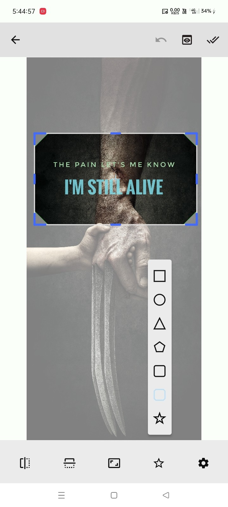
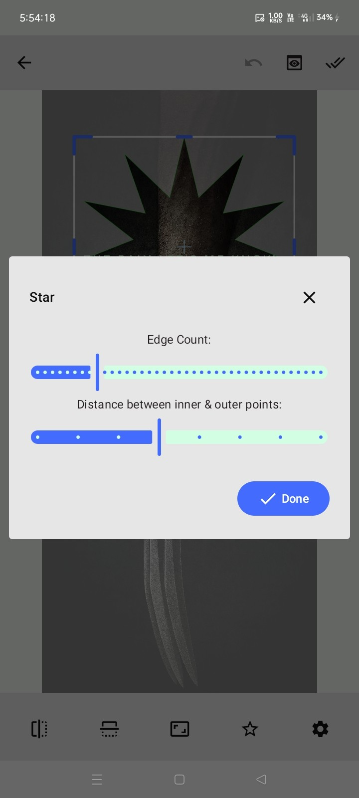

# ✂️ Image Krop

[](https://jitpack.io/#com.github.bashpsk.emptylibs/image-krop)
[](https://opensource.org/licenses/Apache-2.0)

An advanced image cropping library for Jetpack Compose. It provides a highly customizable UI for
selecting, resizing, and shaping crop areas with support for predefined aspect ratios and unique
shapes.

---

## ✨ Features

- **Aspect Ratio Control**: Predefined ratios (1:1, 16:9, 4:3, etc.) or free-form cropping.
- **Crop Shapes**: Apply unique masks like Circles, Stars, and Polygons to your crop.
- **Interactive Selection**: Intuitive handles for dragging and resizing the crop area.
- **Flipping & Rotation**: Flip the image horizontally or vertically during cropping.
- **Live Preview**: Built-in preview to see the final result before exporting.
- **Customizable UI**: Configure handle colors, overlay transparency, and more via `KropConfig`.

---

## 📦 Installation

### Groovy (`build.gradle`)

```groovy
dependencies {
    implementation 'com.github.bashpsk.emptylibs:image-krop:VERSION'
}
```

### Kotlin DSL (`build.gradle.kts`)

```kotlin
dependencies {
    implementation("com.github.bashpsk.emptylibs:image-krop:VERSION")
}
```

### Kotlin DSL (`build.gradle.kts`) + Version Catalog (`libs.versions.toml`)

```toml
[versions]
empty-libs = "VERSION"

[libraries]
emptylibs-image-krop = { group = "com.github.bashpsk.emptylibs", name = "image-krop", version.ref = "empty-libs" }
```

```kotlin
dependencies {
    implementation(libs.emptylibs.image.krop)
}
```

---

## 🛠️ Usage

```kotlin
val imageKropState = rememberImageKropState(imageBitmap = baseImage)
val coroutineScope = rememberCoroutineScope()

ImageKrop(
    modifier = Modifier.fillMaxSize(),
    state = imageKropState,
    onKropFinished = {
        coroutineScope.launch {
            // Generate the final cropped image
            val finalImage = imageKropState.modifiedImage
        }
    },
    onNavigateBack = { /* Handle back navigation */ }
)
```

---

## 📸 Screenshots

| Image Krop UI                                      | Shape Customization                                           |
|----------------------------------------------------|---------------------------------------------------------------|
|  |  |

https://github.com/user-attachments/assets/d02eaaba-b8cb-41c8-aeb6-1eef8459b8f4

---