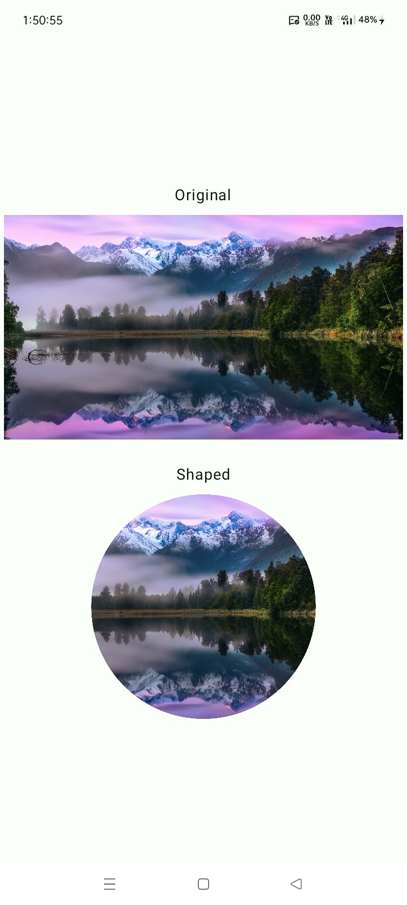
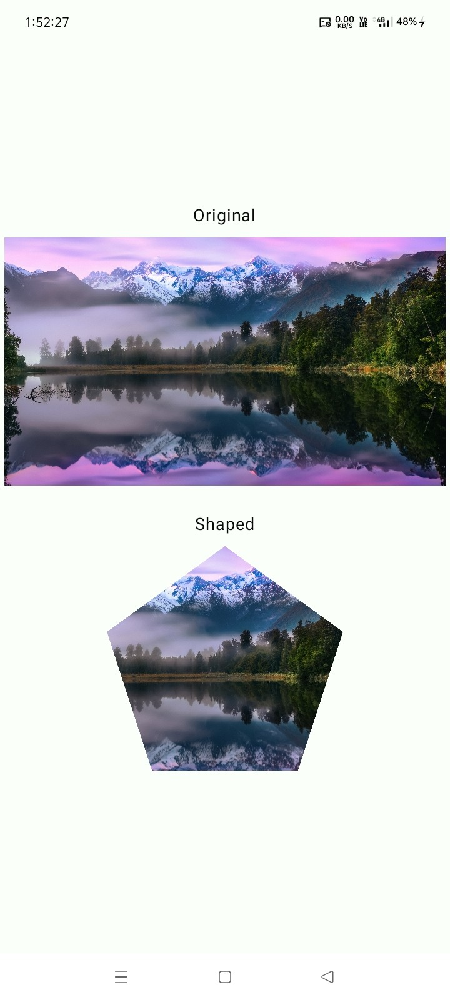
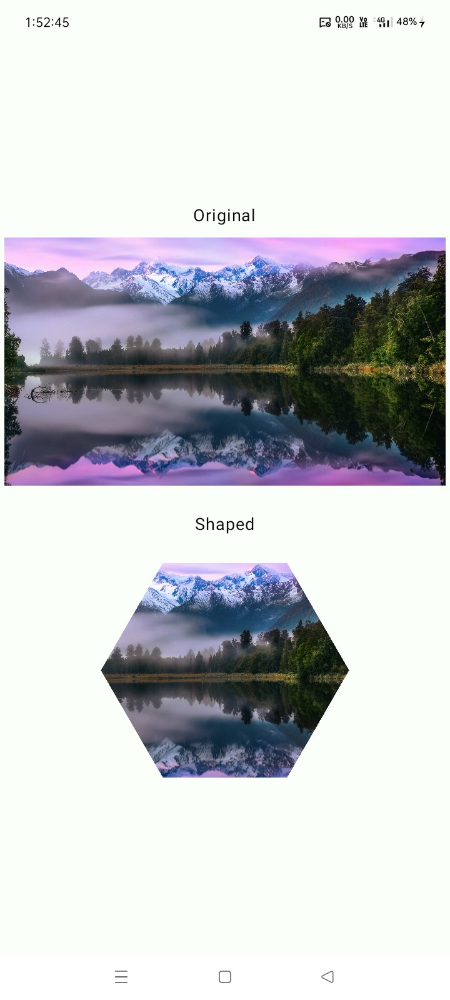
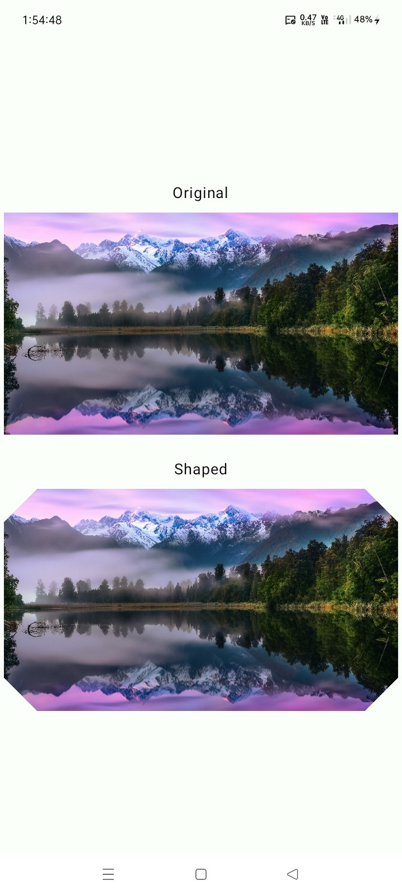
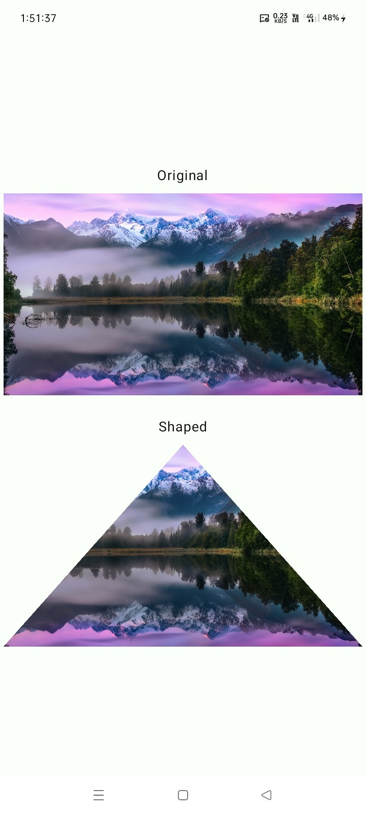

# ✨ Image Utils

[](https://jitpack.io/#com.github.bashpsk.emptylibs/image-utils)
[](https://opensource.org/licenses/Apache-2.0)

A powerful utility library for Jetpack Compose, designed to simplify image manipulation tasks such
as applying shape masks and performing common bitmap calculations.

---

## ✨ Features

- **Advanced Shape Masking**: Apply predefined shapes (Circle, Star, Polygon, etc.) to any
  `ImageBitmap` via the `.bitmapMask()` extension.
- **Extensible Shape System**: Easily define custom shapes using the `ImageShape` sealed class.
- **Bitmap Extensions**:
    - `toSize()`: Safely convert `ImageBitmap` to `Size`.
    - `fittedImageSize()`: Calculate optimal dimensions to fit a canvas while preserving aspect
      ratio.
    - `sameAs()`: Efficiently compare two `ImageBitmap` instances.
- **Predefined Presets**: Quick access to common shapes via `BasicImageShapes`.

---

## 📦 Installation

### Groovy (`build.gradle`)

```groovy
dependencies {
    implementation 'com.github.bashpsk.emptylibs:image-utils:VERSION'
}
```

### Kotlin DSL (`build.gradle.kts`)

```kotlin
dependencies {
    implementation("com.github.bashpsk.emptylibs:image-utils:VERSION")
}
```

### Kotlin DSL (`build.gradle.kts`) + Version Catalog (`libs.versions.toml`)

```toml
[versions]
empty-libs = "VERSION"

[libraries]
emptylibs-image-utils = { group = "com.github.bashpsk.emptylibs", name = "image-utils", version.ref = "empty-libs" }
```

```kotlin
dependencies {
    implementation(libs.emptylibs.image.utils)
}
```

---

## 🛠️ Usage

### Applying a Shape Mask

```kotlin
// 1. Define the shape
val starShape = PathShape.Star(edges = 5, distance = 2.5f)

// 2. Apply the mask
val shapedBitmap: ImageBitmap = starShape.bitmapMask(imageBitmap = originalBitmap)

// Now 'shapedBitmap' contains the original image clipped into a 5-pointed star.
// You can display it in an Image composable.
Image(bitmap = shapedBitmap, contentDescription = "Star-shaped image")
```

### Fitting Image to Canvas

```kotlin
val canvasSize = Size(width = 1080f, height = 1080f) // A square canvas
val imageSize = Size(width = 1920f, height = 1080f)  // A 16:9 image

// Calculate the size of the image to fit inside the canvas with a 10% reduction
val newImageSize = canvasSize.fittedImageSize(imageSize = imageSize, reduction = 10)
// newImageSize will be Size(width=972.0, height=546.75), which fits and is 90% of the max size
```

---

## 📸 Screenshots

|   |   |  |
|----------------------------------------------------------------|------------------------------------------------------------------|-----------------------------------------------------------------|
|  |  |      |

---