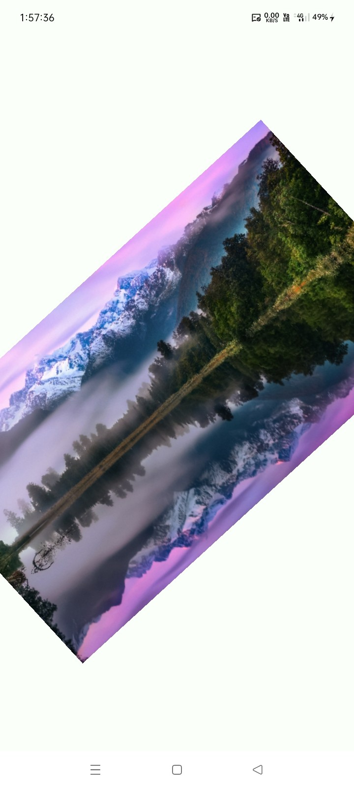

# 🖼️ Image View

[](https://jitpack.io/#com.github.bashpsk.emptylibs/image-view)
[](https://opensource.org/licenses/Apache-2.0)

A powerful transformable image viewer and gallery for Jetpack Compose, built on top of Coil 3.
Supports pinch-to-zoom, panning, and seamless swiping between multiple images.

---

## ✨ Features

- **Advanced Transformations**: Pinch-to-zoom, pan, and two-finger rotation gestures.
- **Double-Tap Zoom**: Intelligently cycle through zoom levels.
- **Image Gallery**: Swipeable `HorizontalPager` for lists of images.
- **Coil 3 Integration**: Native support for asynchronous loading with lifecycle awareness.
- **Hoistable State**: Manage zoom and pan via `ImageTransformState` that survives config changes.
- **Highly Configurable**: Toggle individual gestures and set custom zoom constraints.

---

## 📦 Installation

### Groovy (`build.gradle`)

```groovy
dependencies {
    implementation 'com.github.bashpsk.emptylibs:image-view:VERSION'
}
```

### Kotlin DSL (`build.gradle.kts`)

```kotlin
dependencies {
    implementation("com.github.bashpsk.emptylibs:image-view:VERSION")
}
```

### Kotlin DSL (`build.gradle.kts`) + Version Catalog (`libs.versions.toml`)

```toml
[versions]
empty-libs = "VERSION"

[libraries]
emptylibs-image-view = { group = "com.github.bashpsk.emptylibs", name = "image-view", version.ref = "empty-libs" }
```

```kotlin
dependencies {
    implementation(libs.emptylibs.image.view)
}
```

---

## 🛠️ Usage

### 🖼️ Single Image (Coil)

Display a single image with pinch-to-zoom, pan, and rotation support. Integrates natively with Coil.

```kotlin
TransformImageView(
    modifier = Modifier.fillMaxSize(),
    imageModel = "https://example.com/image.jpg",
    onClick = { offset -> /* Handle single tap */ },
    onLongClick = { offset -> /* Handle long press */ }
)
```

### 🎞️ Image Gallery

Display a swipeable list of images. Paging is disabled while zooming to prevent accidental swipes.

```kotlin
val imageList = persistentListOf(
    "https://example.com/1.jpg",
    "https://example.com/2.jpg",
    "https://example.com/3.jpg"
)

TransformImageView(
    modifier = Modifier.fillMaxSize(),
    imageModelList = imageList,
    initialImage = imageList.first(),
    onImageChanges = { currentImage ->
        // Handle image change
    }
)
```

### 🧩 High-Resolution Tiled Image

For very large local `ImageBitmap` objects, use the tiled renderer to optimize memory usage.

```kotlin
TransformImageView(
    modifier = Modifier.fillMaxSize(),
    imageModel = largeImageBitmap,
    tileSize = 512 // Pixels
)
```

### ⚙️ Custom Configuration

Fine-tune gesture behavior and zoom constraints.

```kotlin
val state = rememberTransformableGesturesState(
    initialZoom = 1.0f,
    zoomRange = 0.5f..10.0f,
    enableRotation = true,
    enablePan = true
)

TransformImageView(
    modifier = Modifier.fillMaxSize(),
    state = state,
    imageModel = imagePath
)
```

---

## 📸 Screenshots

| Image View                                                      |
|-----------------------------------------------------------------|
|  |

https://github.com/user-attachments/assets/275abf83-5532-4458-a026-367300c18adf

---
