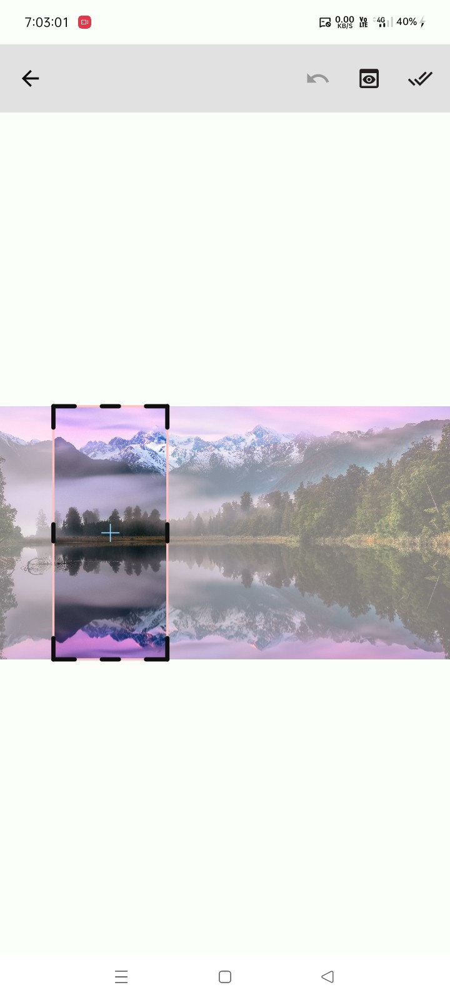
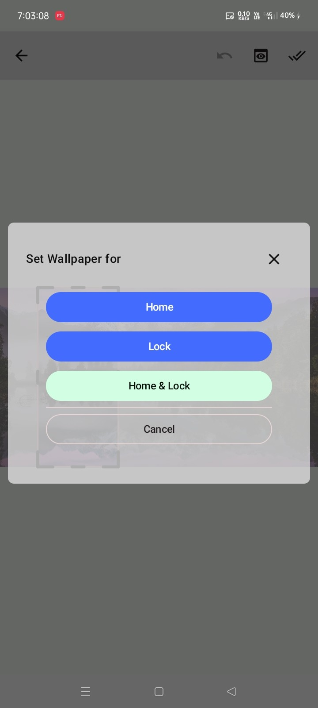

# 📱 Image Wallpaper

[](https://jitpack.io/#com.github.bashpsk.emptylibs/image-wallpaper)
[](https://opensource.org/licenses/Apache-2.0)

A seamless, all-in-one Jetpack Compose library for cropping images to device dimensions and setting
them as Android wallpapers.

---

## ✨ Features

- **Integrated Workflow**: Manage the entire process from cropping to setting the wallpaper in one
  composable.
- **Auto Aspect Ratio**: Automatically detects device screen dimensions and locks the cropper for a
  perfect fit.
- **Multi-Destination Support**: Set wallpapers for Home Screen, Lock Screen, or both.
- **Async Processing**: Wallpapers are set on background threads to keep the UI responsive.
- **Customizable UI**: Leverages `image-krop` configurations for a consistent look.

---

## 📦 Installation

### Groovy (`build.gradle`)

```groovy
dependencies {
    implementation 'com.github.bashpsk.emptylibs:image-wallpaper:VERSION'
}
```

### Kotlin DSL (`build.gradle.kts`)

```kotlin
dependencies {
    implementation("com.github.bashpsk.emptylibs:image-wallpaper:VERSION")
}
```

### Kotlin DSL (`build.gradle.kts`) + Version Catalog (`libs.versions.toml`)

```toml
[versions]
empty-libs = "VERSION"

[libraries]
emptylibs-image-wallpaper = { group = "com.github.bashpsk.emptylibs", name = "image-wallpaper", version.ref = "empty-libs" }
```

```kotlin
dependencies {
    implementation(libs.emptylibs.image.wallpaper)
}
```

---

## 🛠️ Usage

```kotlin
ImageWallpaper(
    modifier = Modifier.fillMaxSize(),
    imageBitmap = baseImage,
    onWallpaperResult = { type, result ->
        // Handle the result, e.g., show a toast and navigate away
    },
    onNavigateBack = { /* Handle back navigation */ }
)
```

---

## 📸 Screenshots

| Wallpaper Cropping                                        | Destination Selection                                            |
|-----------------------------------------------------------|------------------------------------------------------------------|
|  |  |

https://github.com/user-attachments/assets/5f5a510b-4e7a-41d2-aa43-1d456199b609

---