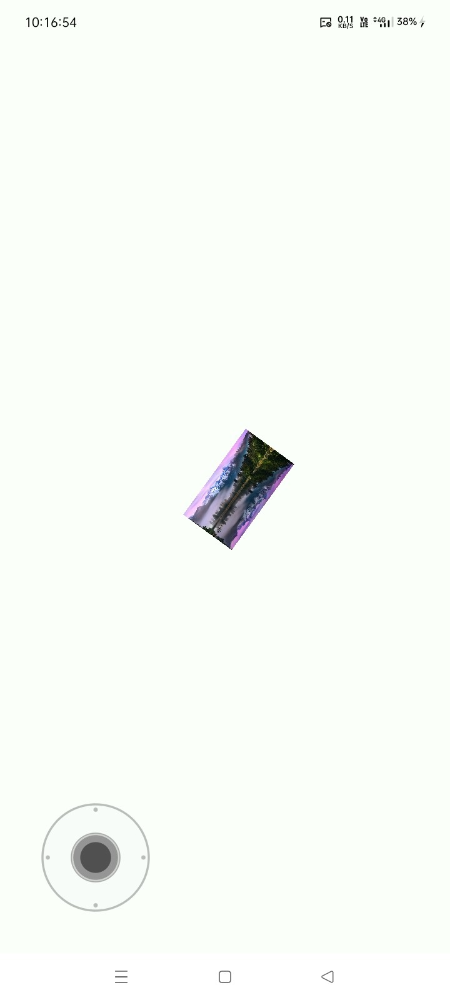
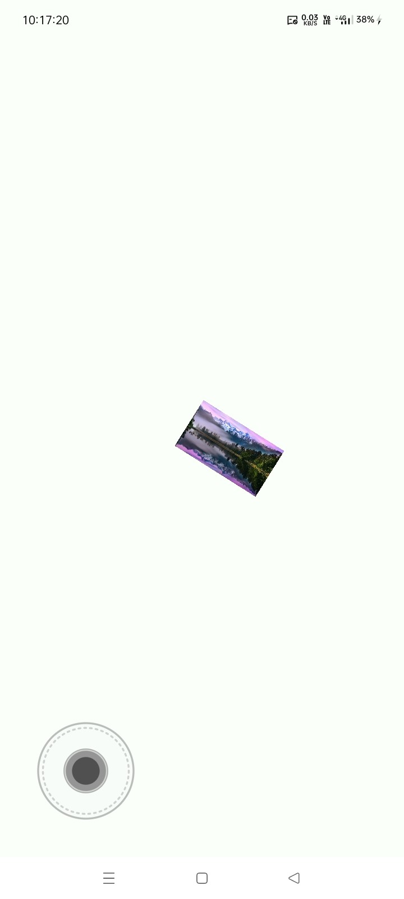
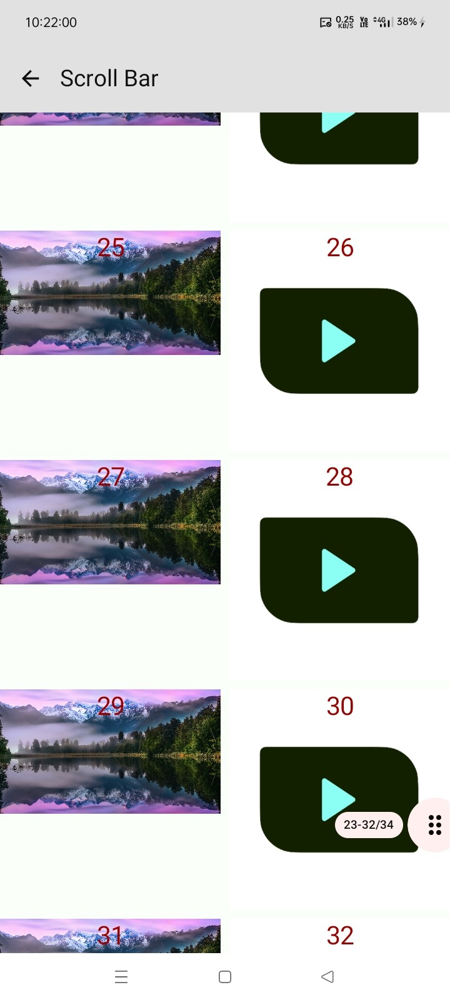
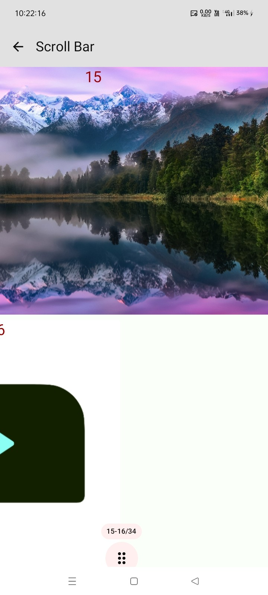

# 💎 Jetpack UI

[](https://jitpack.io/#com.github.bashpsk.emptylibs/jetpack-ui)
[](https://opensource.org/licenses/Apache-2.0)

A versatile collection of modern UI components for Jetpack Compose, animated navigation bars, and
custom pickers.

---

## ✨ Features

- **AnimatedBottomNavBar**: Engaging navigation bar with smooth icon scaling and label transitions.
- **BottomOptionBar**: Adaptive bar with an overflow "More" menu for extra actions.
- **DialTextPicker**: Circular picker for intuitive numerical or time selection.
- **WheelTextPicker**: Classic slot-machine style vertical picker with haptic feedback.
- **BasicTextEditor**: Line-numbered text field wrapper for code or plain text.

---

## 📦 Installation

### Groovy (`build.gradle`)

```groovy
dependencies {
    implementation 'com.github.bashpsk.emptylibs:jetpack-ui:VERSION'
}
```

### Kotlin DSL (`build.gradle.kts`)

```kotlin
dependencies {
    implementation("com.github.bashpsk.emptylibs:jetpack-ui:VERSION")
}
```

### Kotlin DSL (`build.gradle.kts`) + Version Catalog (`libs.versions.toml`)

```toml
[versions]
empty-libs = "VERSION"

[libraries]
emptylibs-jetpack-ui = { group = "com.github.bashpsk.emptylibs", name = "jetpack-ui", version.ref = "empty-libs" }
```

```kotlin
dependencies {
    implementation(libs.emptylibs.jetpack.ui)
}
```

---

## 🛠️ Usage

### 🗺️ Navigation

#### Animated Bottom Nav Bar

Modern navigation bar with fluid scaling and label transitions.

```kotlin
Scaffold(
    bottomBar = {
        AnimatedBottomNavBar {
            navItems.forEach { item ->
                BottomNavItem(
                    isSelected = item == selectedItem,
                    label = item.label,
                    icon = item.icon,
                    onItemClick = { selectedItem = item }
                )
            }
        }
    }
) { /* Content */ }
```

#### Bottom Option Bar

Adaptive toolbar with automatic overflow handling for extra actions.

```kotlin
val options = persistentListOf(
    OptionBarData("Edit", Icons.Default.Edit),
    OptionBarData("Share", Icons.Default.Share),
    OptionBarData("Delete", Icons.Default.Delete),
    OptionBarData("Info", Icons.Default.Info)
)

BottomOptionBar(
    optionList = options,
    onOptionClick = { option -> /* Handle click */ },
    maxLines = 1 // Rest goes to "More" menu
)
```

### 🔢 Pickers

#### Dial & Wheel Text Pickers

Circular and slot-machine style selection components.

```kotlin
// Dial Picker
val hours = (0..23).map { it.toString().padStart(2, '0') }.toImmutableList()
val dialState = rememberDialTextPickerState(textList = hours, initial = "12")
DialTextPicker(state = dialState)

// Wheel Picker
val minutes = (0..59).map { it.toString().padStart(2, '0') }.toImmutableList()
val wheelState = rememberWheelTextPickerState(textList = minutes)
WheelTextPicker(state = wheelState, visibleCount = 5)
```

### 📝 Text Tools

#### Lazy Text Viewer

High-performance viewer capable of rendering millions of lines efficiently.

```kotlin
val state = rememberLazyTextViewerState(
    source = TextSource.Path("/sdcard/large_log.txt")
)

LazyTextViewer(
    modifier = Modifier.fillMaxSize(),
    state = state
)
```

#### Basic Text Editor

Simple editor with line numbers and standard text field features.

```kotlin
BasicTextEditor(
    modifier = Modifier.fillMaxSize(),
    inputContent = myCodeString,
    onContentChange = { myCodeString = it }
)
```

### 🕹️ Controls

#### JoyStick

Touch-based joystick for games or interactive controls.

```kotlin
val joyStickState = rememberJoyStickState(
    properties = JoyStickDefaults.properties(speed = 5.dp)
)

JoyStick(
    modifier = Modifier.size(150.dp),
    state = joyStickState
)

// Observe movement
val movement = joyStickState.changes.input // Offset(-1.0..1.0, -1.0..1.0)
```

### 📊 Data Visualization

#### Seven-Segment Display

Retro-style 7-segment character and string display.

```kotlin
SevenSegmentDisplay(
    data = "12:34:56",
    colors = SevenSegmentDefault.colors(activeColor = Color.Red),
    properties = SevenSegmentDefault.properties(thickness = 4.dp)
)
```

### 📜 Scrolling

#### Lazy List & Grid ScrollBars

Custom scrollbars that fade in during scroll and support index labels.

```kotlin
// For LazyColumn
BoxWithConstraints {
    val listState = rememberLazyListState()
    LazyColumn(state = listState) { /* Items */ }

    LazyListScrollBar(
        state = listState,
        thumbColor = MaterialTheme.colorScheme.primary,
        thumbNotchWidth = 12.dp,
        label = { index, _, _ ->
            Text("Item #$index", style = MaterialTheme.typography.labelSmall)
        }
    )
}

// For LazyVerticalGrid
BoxWithConstraints {
    val gridState = rememberLazyGridState()
    LazyVerticalGrid(state = gridState, columns = GridCells.Fixed(3)) { /* Items */ }

    LazyGridScrollBar(
        state = gridState,
        thumbColor = MaterialTheme.colorScheme.secondary,
        label = { index, _, _ ->
            Text("Row ${index / 3}", style = MaterialTheme.typography.labelSmall)
        }
    )
}
```

---

## 📸 Screenshots

### Bottom Option Bar:

| Adaptive Bottom Bar                                               | Adaptive Bottom Bar - Overflow Menu                                        | Adaptive Bottom Bar - Landscape                                             |
|-------------------------------------------------------------------|----------------------------------------------------------------------------|-----------------------------------------------------------------------------|
|  |  |  |

https://github.com/user-attachments/assets/ef8c7860-e472-438f-99ce-5d9490a39e04

### Text Picker:

| Dial Text Picker                                                 | Wheel Text Picker                                                 |
|------------------------------------------------------------------|-------------------------------------------------------------------|
|  |  |

https://github.com/user-attachments/assets/0cb6bdc0-6b7a-4ce7-85dc-939bacbc5541

https://github.com/user-attachments/assets/250bbce5-b6c3-47cc-af90-63bf8898c0f3

### Text Editor & Viewer:

| Basic Text Editor                                                 | Lazy Text Viewer                                                       |
|-------------------------------------------------------------------|------------------------------------------------------------------------|
|  |  |

https://github.com/user-attachments/assets/5a6ab890-8bae-4e07-8c72-22a2c6ea8729

[//]: # (https://github.com/user-attachments/assets/5a6ab890-8bae-4e07-8c72-22a2c6ea8729)

### JoyStick:

| Type 01                                                         | Type 02                                                         | Type 03                                                         |
|-----------------------------------------------------------------|-----------------------------------------------------------------|-----------------------------------------------------------------|
|  |  |  |

[//]: # (https://github.com/user-attachments/assets/5a6ab890-8bae-4e07-8c72-22a2c6ea8729)

### Lazy List & Grid Scrollbars:

| Lazy Column                                                          | Lazy Row                                                          |
|----------------------------------------------------------------------|-------------------------------------------------------------------|
|  |  |

[//]: # (https://github.com/user-attachments/assets/5a6ab890-8bae-4e07-8c72-22a2c6ea8729)

[//]: # (https://github.com/user-attachments/assets/5a6ab890-8bae-4e07-8c72-22a2c6ea8729)

---