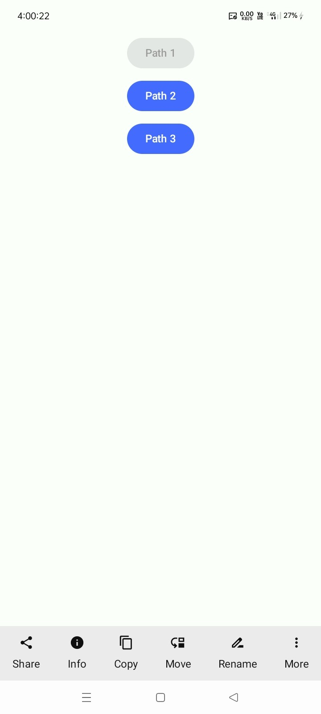
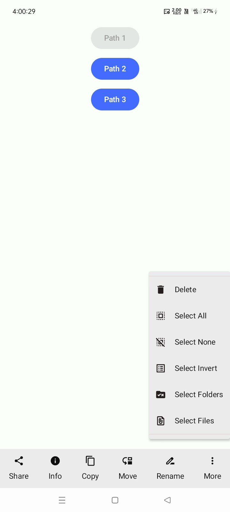
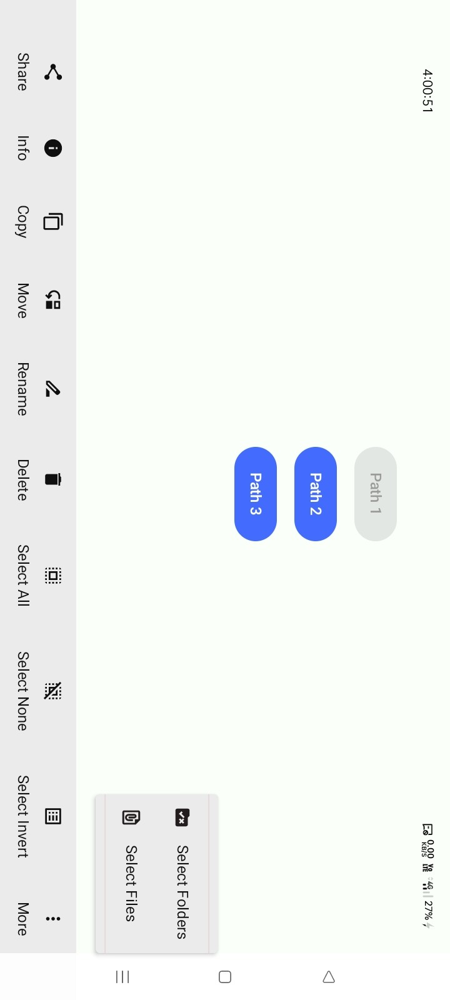
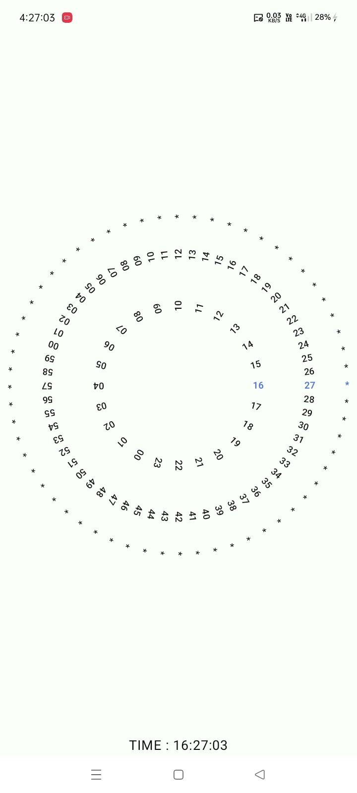
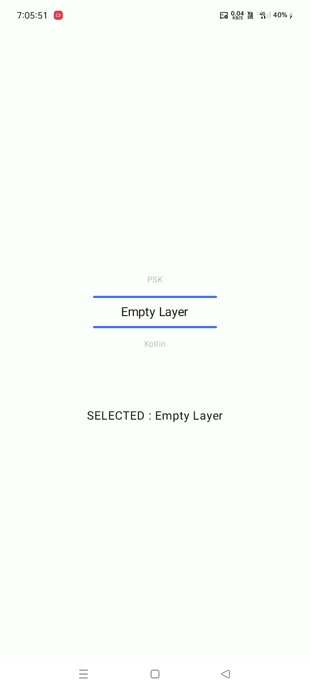
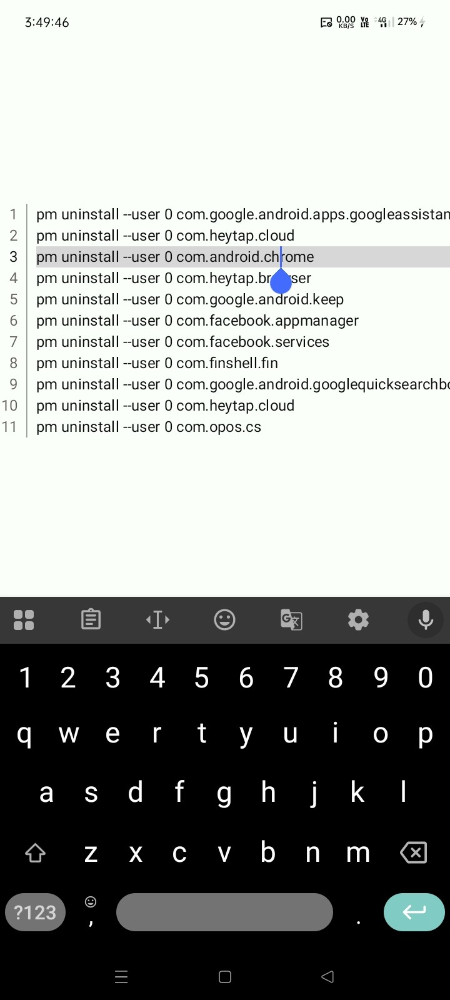
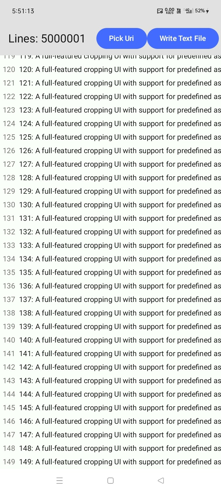

# 💎 Jetpack UI

[](https://jitpack.io/#com.github.bashpsk.emptylibs/jetpack-ui)
[](https://opensource.org/licenses/Apache-2.0)

A versatile collection of modern UI components for Jetpack Compose, animated navigation bars, and
custom pickers.

---

## ✨ Features

- **AnimatedBottomNavBar**: Engaging navigation bar with smooth icon scaling and label transitions.
- **BottomOptionBar**: Adaptive bar with an overflow "More" menu for extra actions.
- **DialTextPicker**: Circular picker for intuitive numerical or time selection.
- **WheelTextPicker**: Classic slot-machine style vertical picker with haptic feedback.
- **BasicTextEditor**: Line-numbered text field wrapper for code or plain text.

---

## 📦 Installation

### Groovy (`build.gradle`)

```groovy
dependencies {
    implementation 'com.github.bashpsk.emptylibs:jetpack-ui:VERSION'
}
```

### Kotlin DSL (`build.gradle.kts`)

```kotlin
dependencies {
    implementation("com.github.bashpsk.emptylibs:jetpack-ui:VERSION")
}
```

### Kotlin DSL (`build.gradle.kts`) + Version Catalog (`libs.versions.toml`)

```toml
[versions]
empty-libs = "VERSION"

[libraries]
emptylibs-jetpack-ui = { group = "com.github.bashpsk.emptylibs", name = "jetpack-ui", version.ref = "empty-libs" }
```

```kotlin
dependencies {
    implementation(libs.emptylibs.jetpack.ui)
}
```

---

## 🛠️ Usage

### 1. Animated Bottom Nav Bar

```kotlin
Scaffold(
    bottomBar = {
        AnimatedBottomNavBar {
            navItems.forEach { item ->
                BottomNavItem(
                    isSelected = item == selectedItem,
                    label = item.label,
                    icon = item.icon,
                    onItemClick = { selectedItem = item }
                )
            }
        }
    }
) { paddingValues ->
    // Screen content
}
```

### 2. Bottom Option Bar

```kotlin
val options = listOf(
    OptionBarData(label = "Edit", icon = Icons.Default.Edit),
    OptionBarData(label = "Favorite", icon = Icons.Default.Favorite),
    OptionBarData(label = "Share", icon = Icons.Default.Share),
    OptionBarData(label = "Delete", icon = Icons.Default.Delete),
    OptionBarData(label = "Info", icon = Icons.Default.Info)
).toImmutableList()

// This will show as many items as can fit on one line,
// and the rest will be in a "More" menu.
BottomOptionBar(
    optionList = options,
    onOptionClick = { option ->
        // Handle option click
    },
    maxLines = 1
)
```

### 3. Dial Text Picker

```kotlin
val hours = (0..23).map { it.toString().padStart(2, '0') }.toImmutableList()
val dialState = rememberDialTextPickerState(textList = hours, initial = "08")

DialTextPicker(state = dialState)
// Observe selected item
Text("Selected Hour: ${dialState.selectedText}")
```

### 4. Wheel Text Picker

A vertical wheel-style picker.

```kotlin
val minutes = (0..59).map { it.toString() }.toImmutableList()
val wheelState = rememberWheelTextPickerState(textList = minutes)

WheelTextPicker(
    state = wheelState,
    visibleCount = 5, // Show 5 items at a time
    textStyle = MaterialTheme.typography.bodyMedium,
    dividerFraction = 0.5F, //  50% of width from 'WheelTextPicker' width
    dividerColor = MaterialTheme.colorScheme.primary,
    dividerThickness = 4.dp
)

// Observe selected item
Text("Selected Minute: ${wheelState.selectedText}")
```

### 5. Basic Text Editor

A simple, line-numbered BasicTextField wrapper.

```kotlin
var code by remember { mutableStateOf("fun main() {\n    println(\"Hello, World!\")\n}") }

BasicTextEditor(
    modifier = Modifier.fillMaxSize(),
    inputContent = code,
    onContentChange = { newContent ->
        code = newContent
    }
)
```

---

## 📸 Screenshots

### Bottom Option Bar:

| Adaptive Bottom Bar                                               | Adaptive Bottom Bar - Overflow Menu                                        | Adaptive Bottom Bar - Landscape                                             |
|-------------------------------------------------------------------|----------------------------------------------------------------------------|-----------------------------------------------------------------------------|
|  |  |  |

https://github.com/user-attachments/assets/ef8c7860-e472-438f-99ce-5d9490a39e04

### Text Picker:

| Dial Text Picker                                                 | Wheel Text Picker                                                 |
|------------------------------------------------------------------|-------------------------------------------------------------------|
|  |  |

https://github.com/user-attachments/assets/0cb6bdc0-6b7a-4ce7-85dc-939bacbc5541

https://github.com/user-attachments/assets/250bbce5-b6c3-47cc-af90-63bf8898c0f3

### Text Editor & Viewer:

| Basic Text Editor                                                 | Lazy Text Viewer                                                       |
|-------------------------------------------------------------------|------------------------------------------------------------------------|
|  |  |

https://github.com/user-attachments/assets/5a6ab890-8bae-4e07-8c72-22a2c6ea8729

[//]: # (https://github.com/user-attachments/assets/5a6ab890-8bae-4e07-8c72-22a2c6ea8729)

---