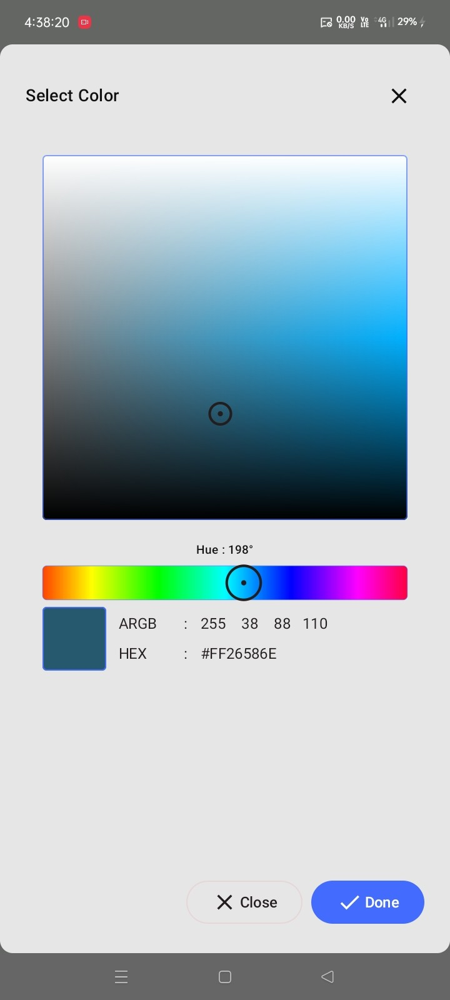
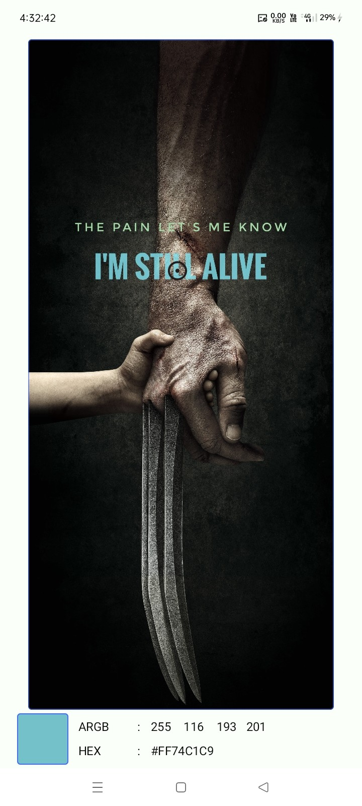
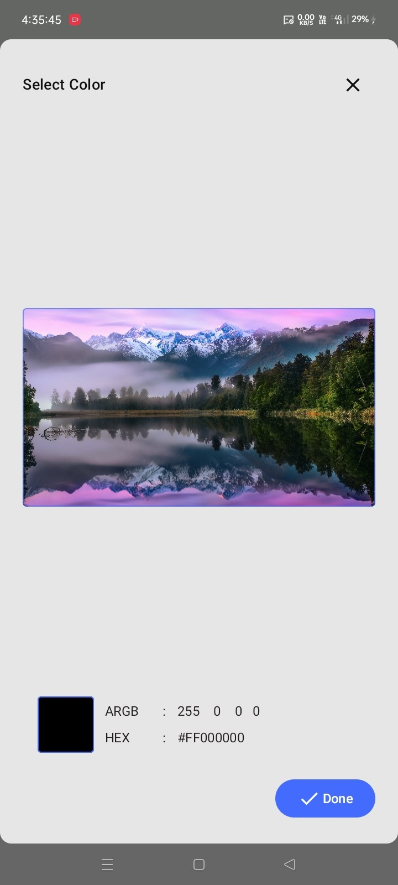

# 🎨 Kolor Picker

[](https://jitpack.io/#com.github.bashpsk.emptylibs/kolor-picker)
[](https://opensource.org/licenses/Apache-2.0)

A powerful and versatile color picker for Jetpack Compose. Includes HSL panels, image-based dropper
tools, and ready-to-use dialogs.

---

## ✨ Features

- **HSL Color Picker**: Draggable saturation/lightness panel with hue and alpha sliders.
- **Image Dropper**: Extract colors directly from any `ImageBitmap` by tapping or dragging.
- **Ready-to-Use Dialogs**: Pre-built, animated `AlertDialog` wrappers for quick integration.
- **State Management**: Hoistable `KolorPickerState` for easy control and observation.
- **Clipboard Support**: Optional buttons for copying/pasting HEX and ARGB codes.

---

## 📦 Installation

### Groovy (`build.gradle`)

```groovy
dependencies {
    implementation 'com.github.bashpsk.emptylibs:kolor-picker:VERSION'
}
```

### Kotlin DSL (`build.gradle.kts`)

```kotlin
dependencies {
    implementation("com.github.bashpsk.emptylibs:kolor-picker:VERSION")
}
```

### Kotlin DSL (`build.gradle.kts`) + Version Catalog (`libs.versions.toml`)

```toml
[versions]
empty-libs = "VERSION"

[libraries]
emptylibs-kolor-picker = { group = "com.github.bashpsk.emptylibs", name = "kolor-picker", version.ref = "empty-libs" }
```

```kotlin
dependencies {
    implementation(libs.emptylibs.kolor.picker)
}
```

---

## 🛠️ Usage

### 1. Standard Color Picker

```kotlin
val colorPickerState = rememberKolorPickerState(initialColor = MaterialTheme.colorScheme.primary)

KolorPicker(
    state = colorState,
    enableAlphaPanel = true, // Enable transparency slider
    enableCopyButtons = true // Show copy/paste buttons
)

Box(
    modifier = Modifier
        .size(64.dp)
        .background(colorPickerState.selectedColor)
)
```

### 2. Image Color Picker

```kotlin
val colorPickerState = rememberKolorPickerState()

ImageKolorPicker(
    imageBitmap = sourceBitmap,
    state = colorPickerState
)

Box(
    modifier = Modifier
        .size(64.dp)
        .background(colorPickerState.selectedColor)
)
```

### 3. Color Picker Dialog

```kotlin
val colorPickerState = rememberKolorPickerState()

// Button to open the dialog
Button(onClick = { kolorPickerState.dialogVisible.targetState = true }) {
    Text("Choose Color")
}

// The dialog itself
KolorPickerDialog(
    state = colorPickerState,
    onSelectedColor = { newColor ->
        // Handle the final selected color
    }
)

// Image Color Picker Dialog
KolorPickerDialog(
    state = colorPickerState,
    imageBitmap = baseImage,
    onSelectedColor = { newColor ->
        // Handle the final selected color
    }
)
```

---

## 📸 Screenshots

| Color Picker - UI                                    | Color Picker - Dialog                                    |
|------------------------------------------------------|----------------------------------------------------------|
|  |  |

https://github.com/user-attachments/assets/a821af0d-cff9-4525-9f92-40529549bdb8

https://github.com/user-attachments/assets/7d6babb8-2350-42aa-b2c5-f012155c584a

| Image Color Picker - UI                                         | Image Color Picker - Dialog                                         |
|-----------------------------------------------------------------|---------------------------------------------------------------------|
|  |  |

https://github.com/user-attachments/assets/5dbc8819-d72e-4eef-ab15-4169ef8345ff

https://github.com/user-attachments/assets/e073fa98-94ba-4240-95a3-35a0188b97cc

---