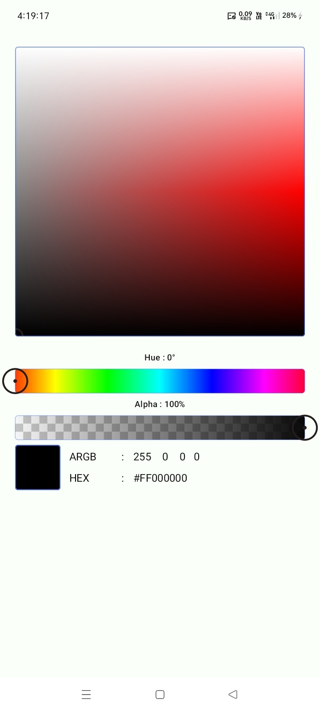

# Kolor Picker - An Advanced Color Picker for Jetpack Compose

A powerful and versatile color picker library for Jetpack Compose, offering multiple ways to select
colors, including a classic HSL panel, an image-based dropper tool, and a ready-to-use dialog.

`kolor-picker` provides a suite of composables to handle all your color selection needs. It features
a standard `KolorPicker` with hue, saturation, and lightness controls, an `ImageKolorPicker` to
extract colors directly from a bitmap, and a pre-built `KolorPickerDialog` for quick and easy
integration. The library is built with a robust, hoistable state management system
(`KolorPickerState`) that makes it easy to control and observe color changes.

---

## Features

- **Classic HSL Color Picker (`KolorPicker`)**:

    - A draggable saturation/lightness panel.
    - A horizontal slider for hue selection.
    - An optional horizontal slider for alpha/transparency.
    - A live preview of the selected color with its `HEX` and `ARGB` codes.

- **Image Dropper Tool (`ImageKolorPicker`)**:

    - Pick a color directly from an `ImageBitmap` by tapping or dragging.
    - A draggable handle indicates the exact pixel being sampled.
    - The UI automatically adapts to the image's aspect ratio.

- **Ready-to-Use Dialog (`KolorPickerDialog`)**:

    - A pre-built, animated `AlertDialog` that wraps the `KolorPicker` or `ImageKolorPicker`.
    - Comes with "Done", "Close" and optional "Reset" buttons.
    - Handles its own visibility state and provides callbacks for color selection.

- **Robust State Management**:

    - Uses `rememberKolorPickerState()` to create a hoistable, saveable state (`KolorPickerState`).
    - `KolorPickerState` holds the `selectedColor` and can be updated programmatically.

- **Utility Features**:

    - Optional copy/paste buttons to interact with the system clipboard.

---

## Installation

**Groovy (`build.gradle`):**

```groovy
dependencies {
    implementation 'com.github.bashpsk.emptylibs:kolor-picker:<latest-version>'
}
```

**Kotlin DSL (`build.gradle`):**

```kotlin
dependencies {
    implementation("com.github.bashpsk.emptylibs:kolor-picker:<latest-version>")
}
```

**Kotlin DSL with Version Catalogs:**

```toml
[versions]
empty-libs = "<latest-version>"

[libraries]
emptylibs-kolor-picker = { group = "com.github.bashpsk.emptylibs", name = "kolor-picker", version.ref = "empty-libs" }
```

```kotlin
dependencies {
    implementation(libs.emptylibs.kolor.picker)
}
```

---

## Usage

### 1. Normal ColorPicker

Use this for a standard HSL-based color selection UI.

```kotlin
val colorPickerState = rememberKolorPickerState(initialColor = MaterialTheme.colorScheme.primary)

KolorPicker(
    state = colorState,
    enableAlphaPanel = true, // Enable transparency slider
    enableCopyButtons = true // Show copy/paste buttons
)

Box(
    modifier = Modifier
        .size(64.dp)
        .background(colorPickerState.selectedColor)
)
```

### 2. ImageColorPicker

Use this to let users pick a color directly from an image.

```kotlin
val colorPickerState = rememberKolorPickerState()

ImageKolorPicker(
    imageBitmap = sourceBitmap,
    state = colorPickerState
)

Box(
    modifier = Modifier
        .size(64.dp)
        .background(colorPickerState.selectedColor)
)
```

### 3. ColorPickerDialog

```kotlin
val dialogVisibleState = remember { MutableTransitionState(false) }
val colorPickerState = rememberKolorPickerState()

// Button to open the dialog
Button(onClick = { dialogVisibleState.targetState = true }) {
    Text("Choose Color")
}

// The dialog itself
KolorPickerDialog(
    dialogVisibleState = dialogVisibleState,
    state = colorPickerState,
    onSelectedColor = { newColor ->
        // Handle the final selected color
    }
)

// Image Color Picker Dialog
KolorPickerDialog(
    dialogVisibleState = dialogVisibleState,
    state = colorPickerState,
    imageBitmap = baseImage,
    onSelectedColor = { newColor ->
        // Handle the final selected color
    }
)
```

---

## Screenshots & Demo

| Color Picker - UI                                 | Color Picker - Dialog                                    |
|---------------------------------------------------|----------------------------------------------------------|
|  |  |

https://github.com/user-attachments/assets/a821af0d-cff9-4525-9f92-40529549bdb8

https://github.com/user-attachments/assets/7d6babb8-2350-42aa-b2c5-f012155c584a

| Image Color Picker - UI                                 | Image Color Picker - Dialog                                    |
|---------------------------------------------------------|----------------------------------------------------------------|
|  |  |

https://github.com/user-attachments/assets/5dbc8819-d72e-4eef-ab15-4169ef8345ff

https://github.com/user-attachments/assets/e073fa98-94ba-4240-95a3-35a0188b97cc

---