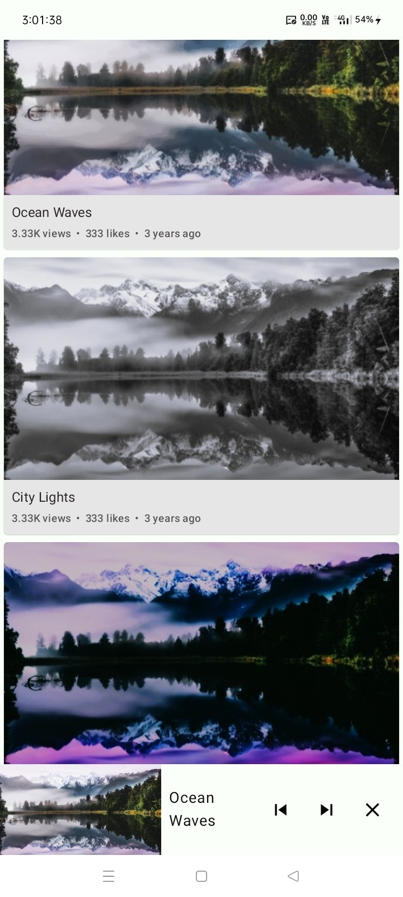
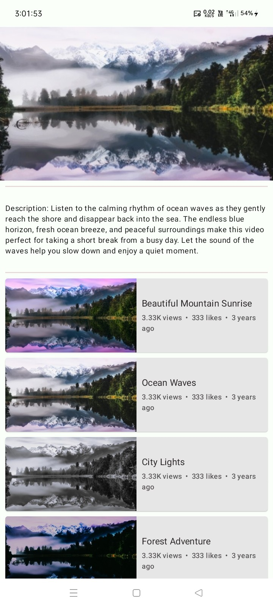
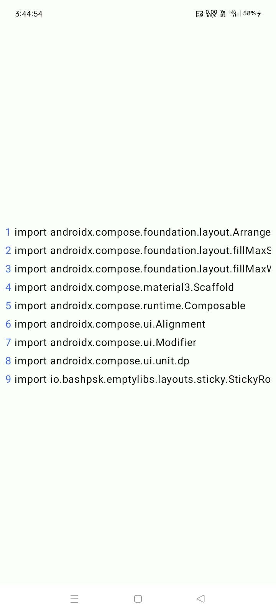
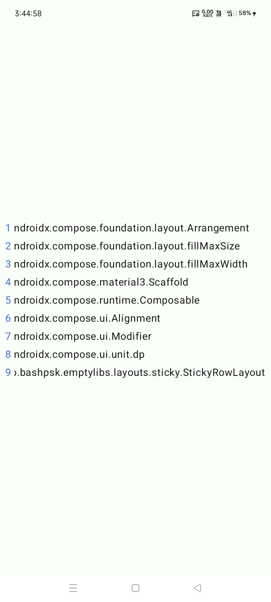
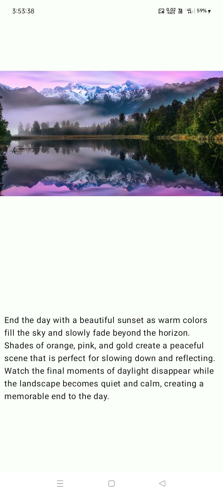
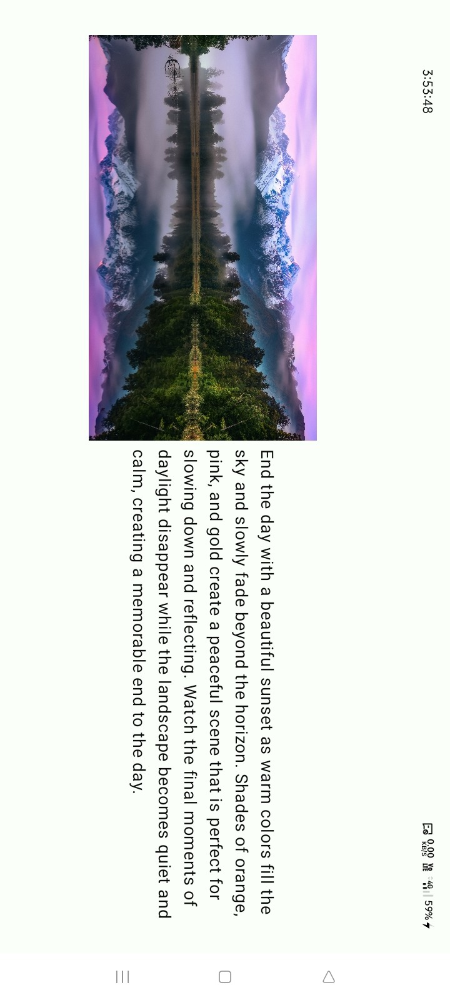
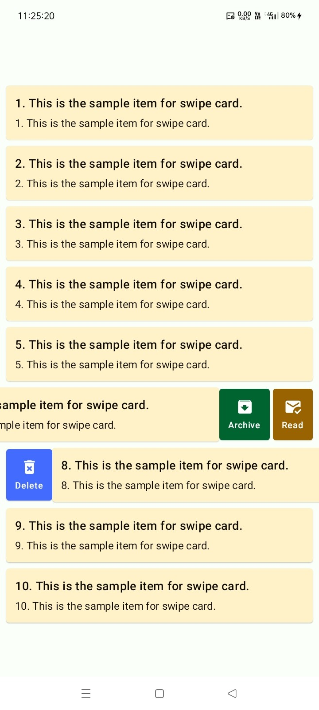
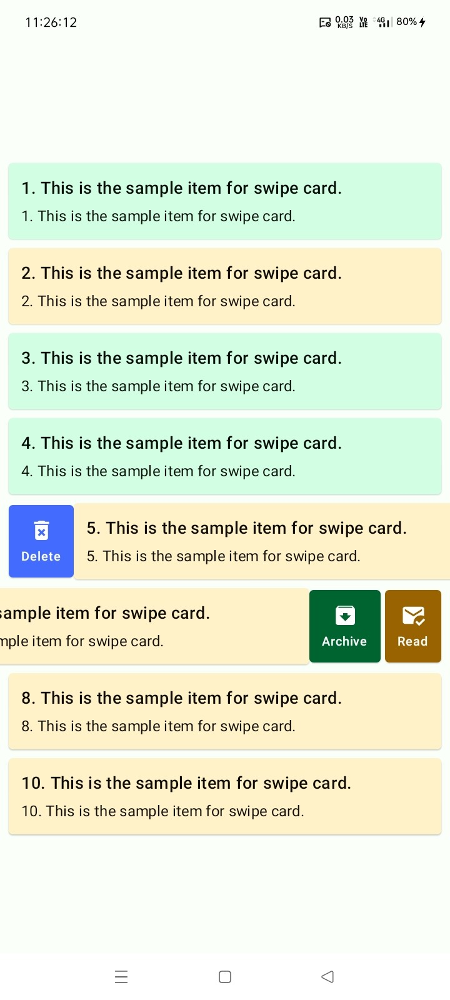

# 📐 Layouts

[](https://jitpack.io/#com.github.bashpsk.emptylibs/layouts)
[](https://opensource.org/licenses/Apache-2.0)

A collection of specialized Jetpack Compose layouts designed for adaptive interfaces, zoomable
content, and interactive UI patterns.

---

## ✨ Features

- **TwoPaneAdaptiveLayout**: Adapts between Row and Column for master-detail views based on screen
  width.
- **SwipeCollapsibleLayout**: Interactive swipe-to-collapse behavior for headers or panels.
- **StickyRowLayout**: Rows with sticky headers that stay visible during scrolling.
- **ZoomableLayout**: A container that provides native zoom and pan capabilities to any child
  content.
- **SwipeRevealItem**: Interactive swipe-to-reveal actions behind a main content area.

---

## 📦 Installation

### Groovy (`build.gradle`)

```groovy
dependencies {
    implementation 'com.github.bashpsk.emptylibs:layouts:VERSION'
}
```

### Kotlin DSL (`build.gradle.kts`)

```kotlin
dependencies {
    implementation("com.github.bashpsk.emptylibs:layouts:VERSION")
}
```

### Kotlin DSL (`build.gradle.kts`) + Version Catalog (`libs.versions.toml`)

```toml
[versions]
empty-libs = "VERSION"

[libraries]
emptylibs-layouts = { group = "com.github.bashpsk.emptylibs", name = "layouts", version.ref = "empty-libs" }
```

```kotlin
dependencies {
    implementation(libs.emptylibs.layouts)
}
```

---

## 🛠️ Usage

### 🌓 Adaptive & Master-Detail (`TwoPaneAdaptiveLayout`)

Automatically switches between side-by-side (Tablet/Landscape) and top-bottom (Phone/Portrait)
layouts.

```kotlin
TwoPaneAdaptiveLayout(
    aspectRatio = 16f / 9f, // Maintain ratio for the first pane
    firstPane = {
        // Video Player or List
    },
    secondPane = {
        // Details or Chat
    }
)
```

### ↕️ Collapsible Panels (`SwipeCollapsibleLayout`)

Implement interactive swipe-to-expand headers or player panels.

```kotlin
val state = rememberSwipeCollapsibleLayoutState(initialValue = CollapsibleLayoutProgress.Collapsed)

SwipeCollapsibleLayout(
    state = state,
    primaryContent = { /* Mini Player / Main Player */ },
    secondaryContent = { /* Mini Player Controls */ },
    tertiaryContent = { /* Player Details/Queue */ }
) { paddingValues ->
    // Main background content (e.g., Video List)
}
```

### 📌 Sticky Components (`StickyRowLayout`)

Keep the first child fixed while the rest of the row scrolls horizontally. Perfect for line numbers.

```kotlin
val scrollState = rememberScrollState()

StickyRowLayout(
    horizontalScroll = scrollState.value,
    verticalAlignment = Alignment.CenterVertically
) {
    // This child stays sticky on the left
    Text("Line 1", modifier = Modifier.padding(8.dp))

    // These children scroll under the sticky element
    Text("Very long content that scrolls...", modifier = Modifier.horizontalScroll(scrollState))
}
```

### 🔍 Interactive Zoom (`ZoomableLayout`)

Add native pinch-to-zoom and panning capabilities to any Composable.

```kotlin
val state = rememberTransformableGesturesState()

ZoomableLayout(
    state = state,
    modifier = Modifier.fillMaxSize()
) {
    // Any content: Images, Canvas, etc.
    Image(
        bitmap = myBitmap,
        contentDescription = null,
        modifier = Modifier.fillMaxSize()
    )
}
```

### 👈👉 Swipe to Reveal (`SwipeRevealItem`)

Reveal actions behind a content area by swiping left or right.

```kotlin
val state = rememberSwipeRevealState()

SwipeRevealItem(
    state = state,
    leftContent = {
        // Left actions (revealed when swiping right)
        Box(modifier = Modifier.fillMaxHeight().width(80.dp).background(Color.Red)) {
            Icon(
                Icons.Default.Delete,
                contentDescription = "Delete",
                modifier = Modifier.align(Alignment.Center)
            )
        }
    },
    rightContent = {
        // Right actions (revealed when swiping left)
        Box(modifier = Modifier.fillMaxHeight().width(80.dp).background(Color.Blue)) {
            Icon(
                Icons.Default.Archive,
                contentDescription = "Archive",
                modifier = Modifier.align(Alignment.Center)
            )
        }
    }
) {
    // Main content
    ListItem(
        headlineContent = { Text("Swipe me!") },
        supportingContent = { Text("Secondary text") }
    )
}
```

---

## 📸 Screenshots

| Layouts                                                           | Transform                                                                |
|-------------------------------------------------------------------|--------------------------------------------------------------------------|
|  |  |
|         |         |
|           |           |
|       |       |

https://github.com/user-attachments/assets/fbaa14f8-f780-424b-bdea-af6cf2fb2359

https://github.com/user-attachments/assets/a6f41237-a748-432f-83c4-5c7c5b5e7a63

https://github.com/user-attachments/assets/2e05af00-f1c7-4806-9ba0-aaadea9cf88d

https://github.com/user-attachments/assets/51c67a87-3913-4b78-9722-0007a94adad7

https://github.com/user-attachments/assets/d8037364-cb1a-4d0e-95e7-f49ca3bd0624

---
