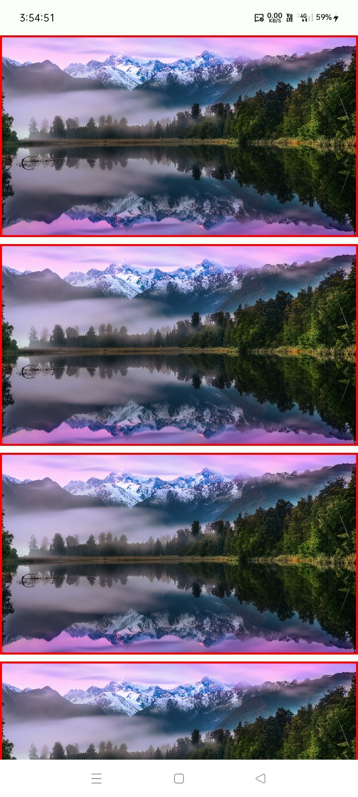
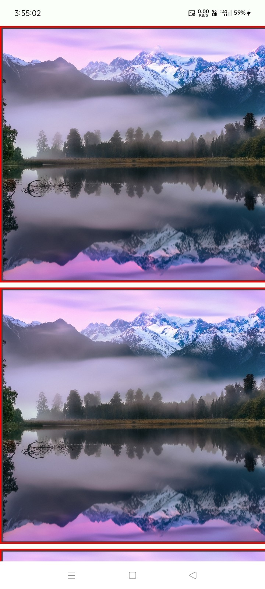

# 📐 Layouts

[](https://jitpack.io/#com.github.bashpsk.emptylibs/layouts)
[](https://opensource.org/licenses/Apache-2.0)

A collection of specialized Jetpack Compose layouts designed for adaptive interfaces, zoomable
content, and interactive UI patterns.

---

## ✨ Features

- **TwoPaneAdaptiveLayout**: Adapts between Row and Column for master-detail views based on screen
  width.
- **SwipeCollapsibleLayout**: Interactive swipe-to-collapse behavior for headers or panels.
- **StickyRowLayout**: Rows with sticky headers that stay visible during scrolling.
- **ZoomableLayout**: A container that provides native zoom and pan capabilities to any child
  content.

---

## 📦 Installation

### Groovy (`build.gradle`)

```groovy
dependencies {
    implementation 'com.github.bashpsk.emptylibs:layouts:VERSION'
}
```

### Kotlin DSL (`build.gradle.kts`)

```kotlin
dependencies {
    implementation("com.github.bashpsk.emptylibs:layouts:VERSION")
}
```

### Kotlin DSL (`build.gradle.kts`) + Version Catalog (`libs.versions.toml`)

```toml
[versions]
empty-libs = "VERSION"

[libraries]
emptylibs-layouts = { group = "com.github.bashpsk.emptylibs", name = "layouts", version.ref = "empty-libs" }
```

```kotlin
dependencies {
    implementation(libs.emptylibs.layouts)
}
```

---

## 🛠️ Usage

### Swipe Collapsible Layout

```kotlin
val state = rememberSwipeCollapsibleLayoutState(initialValue = CollapsibleLayoutProgress.Dismissed)

SwipeCollapsibleLayout(
    modifier = Modifier.fillMaxSize(),
    state = state,
    primaryContent = { /* Player */ },
    secondaryContent = { /* Controls for minimized state */ },
    tertiaryContent = { /* Details & Recommendation section */ }
) { layoutPaddingValues ->
    /* Feed/Videos List Screen */
}
```

### TwoPane Adaptive Layout

```kotlin
TwoPaneAdaptiveLayout(
    aspectRatio = 1.0F,
    firstPane = { /* List */ },
    secondPane = { /* Details */ }
)
```

### Zoomable Layout

```kotlin
val transformableState = rememberTransformableGesturesState(
    initialZoom = 1.0F,
    enableZoom = true,
    enablePan = true,
    enableDoubleTapZoom = true
)

val layoutPosition by remember(transformableState) {
    derivedStateOf { transformableState.position.round().copy(y = 0) }
}

ZoomableLayout(
    modifier = Modifier
        .fillMaxWidth()
        .offset { layoutPosition },
    zoomScale = transformableState.zoom
) {

    Image(
        modifier = Modifier
            .fillMaxWidth()
            .aspectRatio(aspectRatio),
        bitmap = sampleImage,
        contentScale = ContentScale.Fit,
        contentDescription = null
    )
}
```

---

## 📸 Screenshots

| Layouts                                                           | Transform                                                                |
|-------------------------------------------------------------------|--------------------------------------------------------------------------|
|  |  |
|         |         |
|           |           |
|           |           |

[//]: # (https://github.com/user-attachments/assets/07ffb810-a1bb-4db2-b50b-dea5fdc1a626)

---