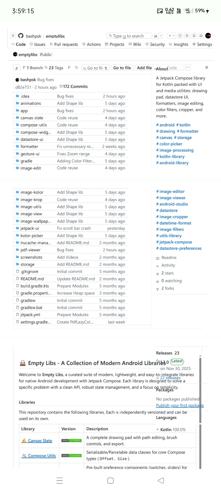
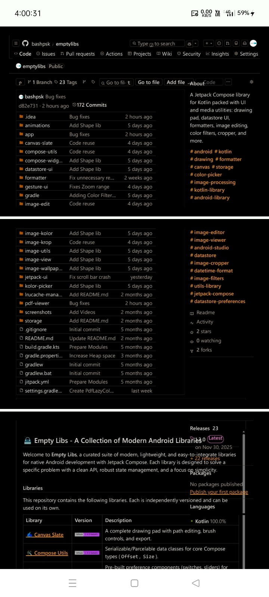

# 📜 PDF Viewer

[](https://jitpack.io/#com.github.bashpsk.emptylibs/pdf-viewer)
[](https://opensource.org/licenses/Apache-2.0)

A lightweight and efficient PDF viewing library for Jetpack Compose. Features a lazy-loading column
for PDF pages with built-in gesture support.

---

## ✨ Features

- **PdfLazyColumn**: A high-performance scrollable list for rendering PDF pages.
- **Gesture Support**: Built-in pinch-to-zoom and panning via `transformableGestures`.
- **ScrollBar Integration**: Native vertical scrollbar with page indicators.
- **Lifecycle Aware**: Efficiently manages page rendering and memory.
- **Customizable**: Control page spacing, placeholders, and color filters.

---

## 📦 Installation

### Groovy (`build.gradle`)

```groovy
dependencies {
    implementation 'com.github.bashpsk.emptylibs:pdf-viewer:VERSION'
}
```

### Kotlin DSL (`build.gradle.kts`)

```kotlin
dependencies {
    implementation("com.github.bashpsk.emptylibs:pdf-viewer:VERSION")
}
```

### Kotlin DSL (`build.gradle.kts`) + Version Catalog (`libs.versions.toml`)

```toml
[versions]
empty-libs = "VERSION"

[libraries]
emptylibs-pdf-viewer = { group = "com.github.bashpsk.emptylibs", name = "pdf-viewer", version.ref = "empty-libs" }
```

```kotlin
dependencies {
    implementation(libs.emptylibs.pdf.viewer)
}
```

---

## 🛠️ Usage

### 📄 Basic Setup

The `PdfLazyColumn` component efficiently renders PDF pages as you scroll.

```kotlin
val state = rememberPdfLazyColumnState(source = PdfSource.URI(pdfUri))

PdfLazyColumn(
    modifier = Modifier.fillMaxSize(),
    state = state,
    pageSpace = 12.dp // Space between pages
)
```

### 📂 PDF Sources

Load documents from various sources using the `PdfSource` sealed class.

```kotlin
// From a content URI (e.g., from a File Picker)
val sourceUri = PdfSource.URI(uri = myPdfUri)

// From a local file path
val sourcePath = PdfSource.Path(path = "/sdcard/Documents/guide.pdf")

// Initialize state
val state = rememberPdfLazyColumnState(source = sourceUri)
```

### ⚙️ Advanced Customization

Fine-tune the viewer's appearance and interactive behavior.

```kotlin
val state = rememberPdfLazyColumnState(
    source = mySource,
    cacheSize = 15,       // Max pages to keep in memory
    initialZoom = 1.0f,
    zoomRange = 1.0f..5.0f
)

PdfLazyColumn(
    modifier = Modifier.fillMaxSize(),
    state = state,
    placeholder = MaterialTheme.colorScheme.surfaceVariant, // Color while rendering
    colorFilter = ColorFilter.tint(Color.Gray, BlendMode.Darken), // Night mode or accessibility
    onClick = { offset ->
        // Handle click on PDF page
    }
)
```

---

## 📸 Screenshots

| PDF Viewer                                             | Color Filter                                           |
|--------------------------------------------------------|--------------------------------------------------------|
|  |  |

[//]: # (https://github.com/user-attachments/assets/07ffb810-a1bb-4db2-b50b-dea5fdc1a626)

---